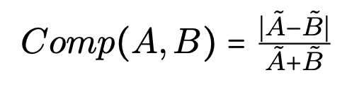

<style>
/* Top navigation bar */
.top-nav {
    background: #000;
    border-bottom: 1px solid #333;
    position: relative;
    left: -90px;
    width: calc(100% + 180px);
    padding: 0;
}
.top-nav-content {
    max-width: 1200px;
    margin: 0 auto;
    padding: 0 40px;
    display: flex;
    gap: 32px;
    align-items: center;
}
.nav-link {
    color: #999;
    text-decoration: none;
    font-size: 14px;
    font-weight: 500;
    padding: 14px 0;
    display: inline-block;
    border-bottom: 2px solid transparent;
    transition: all 0.2s ease;
}
.nav-link:hover {
    color: #fff;
    border-bottom-color: #fff;
}
.nav-link.active {
    color: #fff;
    border-bottom-color: #fff;
}
/* Black header with title */
.header-black {
    background: #000;
    color: #fff;
    padding: 20px 0;
    margin: 0 0 0 0;
    position: relative;
    left: -90px;
    width: calc(100% + 180px);
}
.header-content {
    max-width: 1200px;
    margin: 0 auto;
    padding: 0 40px;
    display: flex;
    justify-content: space-between;
    align-items: center;
    gap: 40px;
}
.header-title {
    font-size: 45px;
    font-weight: 700;
    color: #fff;
    margin: 0;
    letter-spacing: -0.5px;
    flex: 1;
}
.header-fed-rate {
    display: flex;
    align-items: center;
    gap: 20px;
    padding: 16px 24px;
    background: #1a1a1a;
    border-radius: 6px;
    border: 1px solid #333;
}
.fed-rate-info {
    display: flex;
    flex-direction: column;
    gap: 4px;
}
.fed-rate-label {
    font-size: 10px;
    text-transform: uppercase;
    letter-spacing: 1.2px;
    color: #999;
    font-weight: 600;
}
.fed-rate-value {
    font-size: 28px;
    font-weight: 700;
    color: #fff;
    line-height: 1;
}
.fed-rate-change {
    font-size: 12px;
    color: #00d084;
    font-weight: 600;
}
.fed-rate-chart {
    width: 165px;
    height: 60px;
    position: relative;
    background: #0a0a0a;
    border-radius: 4px;
    padding: 8px 8px 8px 24px;
}
.fed-rate-chart svg {
    width: 100%;
    height: 100%;
}
.chart-axis-label {
    font-size: 9px;
    fill: #666;
    font-weight: 500;
}
/* Bloomberg-style market ticker */
.market-ticker-wrapper {
    background: #000;
    color: #fff;
    padding: 0;
    margin: 0 0 30px 0;
    overflow: hidden;
    border-bottom: 1px solid #1a1a1a;
    position: relative;
    left: -90px;
    width: calc(100% + 180px);
}
.market-ticker {
    display: flex;
    animation: scroll-ticker 60s linear infinite;
    white-space: nowrap;
    padding: 12px 0;
}
.ticker-item {
    display: inline-flex;
    align-items: center;
    padding: 0 32px;
    gap: 16px;
    border-right: 1px solid #333;
    font-size: 14px;
    font-weight: 500;
}
.ticker-symbol {
    font-weight: 700;
    font-size: 13px;
    letter-spacing: 0.5px;
    margin-right: 4px;
}
.ticker-price {
    font-weight: 600;
    font-size: 14px;
    margin-left: 4px;
}
.ticker-change {
    font-size: 13px;
    padding: 2px 6px;
    border-radius: 3px;
}
.ticker-change.positive {
    color: #00d084;
    background: rgba(0, 208, 132, 0.1);
}
.ticker-change.negative {
    color: #ff4757;
    background: rgba(255, 71, 87, 0.1);
}
@keyframes scroll-ticker {
    0% { transform: translateX(0); }
    100% { transform: translateX(-50%); }
}
.pulse {
    animation: pulse 2s infinite;
}
@keyframes pulse {
    0%, 100% { opacity: 1; }
    50% { opacity: 0.7; }
}
</style>

<div class="top-nav">
    <div class="top-nav-content">
        <a href="{{ site.baseurl }}/" class="nav-link active">Home</a>
        <a href="{{ site.baseurl }}/other_page" class="nav-link">Analysis</a>
        <a href="{{ site.baseurl }}/game" class="nav-link">Game</a>
        <a href="{{ site.baseurl }}/Beatrice" class="nav-link">Beatrice</a>
        <a href="{{ site.baseurl }}/Cyriac" class="nav-link">Cyriac</a>
        <a href="{{ site.baseurl }}/Lucas" class="nav-link">Lucas</a>
        <a href="{{ site.baseurl }}/Alexis" class="nav-link">Alexis</a>
        <a href="{{ site.github.repository_url }}" class="nav-link" target="_blank">Repository</a>
    </div>
</div>

<div class="header-black">
    <div class="header-content">
        <h1 class="header-title">Do you have what it takes to join Stratton Oakmont ?</h1>
        <div class="header-fed-rate">
            <div class="fed-rate-info">
                <div class="fed-rate-label">Federal Funds Rate</div>
                <div class="fed-rate-value" id="header-fed-rate">4.33%</div>
                <div class="fed-rate-change" id="header-fed-change">↑ 0.25 (Last meeting)</div>
            </div>
            <div class="fed-rate-chart">
                <svg viewBox="-30 0 170 60" preserveAspectRatio="none">
                    <!-- Grid lines -->
                    <line x1="0" y1="12" x2="140" y2="12" stroke="#333" stroke-width="0.5" opacity="0.3"/>
                    <line x1="0" y1="24" x2="140" y2="24" stroke="#333" stroke-width="0.5" opacity="0.3"/>
                    <line x1="0" y1="36" x2="140" y2="36" stroke="#333" stroke-width="0.5" opacity="0.3"/>
                    <!-- Area fill -->
                    <path
                        id="fed-rate-area"
                        fill="url(#gradient)"
                        d="M0,42 L11.67,40 L23.33,37 L35,35 L46.67,32 L58.33,28 L70,25 L81.67,22 L93.33,19 L105,16 L116.67,14 L128.33,12 L140,10 L140,48 L0,48 Z"
                    />
                    <!-- Line chart -->
                    <polyline
                        id="fed-rate-sparkline"
                        fill="none"
                        stroke="#00d084"
                        stroke-width="2.5"
                        stroke-linecap="round"
                        points="0,42 11.67,40 23.33,37 35,35 46.67,32 58.33,28 70,25 81.67,22 93.33,19 105,16 116.67,14 128.33,12 140,10"
                    />
                    <!-- Y-axis labels -->
                    <text x="-30" y="12" class="chart-axis-label" text-anchor="start" id="y-label-high">5.5%</text>
                    <text x="-30" y="36" class="chart-axis-label" text-anchor="start" id="y-label-low">4.0%</text>
                    <!-- Time axis labels -->
                    <text x="0" y="58" class="chart-axis-label">2023</text>
                    <text x="70" y="58" class="chart-axis-label" text-anchor="middle">2024</text>
                    <text x="140" y="58" class="chart-axis-label" text-anchor="end">2025</text>
                    <!-- Gradient definition -->
                    <defs>
                        <linearGradient id="gradient" x1="0%" y1="0%" x2="0%" y2="100%">
                            <stop offset="0%" style="stop-color:#00d084;stop-opacity:0.3" />
                            <stop offset="100%" style="stop-color:#00d084;stop-opacity:0" />
                        </linearGradient>
                    </defs>
                </svg>
            </div>
        </div>
    </div>
</div>

<div class="market-ticker-wrapper">
    <div class="market-ticker" id="market-ticker">
        <!-- First set of tickers -->
        <div class="ticker-item">
            <span class="ticker-symbol">FED RATE</span>
            <span class="ticker-price" id="fed-rate">4.33%</span>
        </div>
        <div class="ticker-item">
            <span class="ticker-symbol">S&P 500</span>
            <span class="ticker-price" id="sp500">6,051.09</span>
            <span class="ticker-change positive" id="sp500-change">+0.82%</span>
        </div>
        <div class="ticker-item">
            <span class="ticker-symbol">DOW</span>
            <span class="ticker-price" id="dow">43,988.99</span>
            <span class="ticker-change negative" id="dow-change">-0.22%</span>
        </div>
        <div class="ticker-item">
            <span class="ticker-symbol">NASDAQ</span>
            <span class="ticker-price" id="nasdaq">19,478.88</span>
            <span class="ticker-change positive" id="nasdaq-change">+1.24%</span>
        </div>
        <div class="ticker-item">
            <span class="ticker-symbol">AAPL</span>
            <span class="ticker-price" id="aapl">245.18</span>
            <span class="ticker-change positive" id="aapl-change">+1.12%</span>
        </div>
        <div class="ticker-item">
            <span class="ticker-symbol">MSFT</span>
            <span class="ticker-price" id="msft">441.58</span>
            <span class="ticker-change positive" id="msft-change">+0.76%</span>
        </div>
        <div class="ticker-item">
            <span class="ticker-symbol">GOOGL</span>
            <span class="ticker-price" id="googl">198.45</span>
            <span class="ticker-change negative" id="googl-change">-0.34%</span>
        </div>
        <div class="ticker-item">
            <span class="ticker-symbol">AMZN</span>
            <span class="ticker-price" id="amzn">227.89</span>
            <span class="ticker-change positive" id="amzn-change">+1.89%</span>
        </div>
        <div class="ticker-item">
            <span class="ticker-symbol">TSLA</span>
            <span class="ticker-price" id="tsla">412.67</span>
            <span class="ticker-change positive" id="tsla-change">+2.34%</span>
        </div>
        <div class="ticker-item">
            <span class="ticker-symbol">META</span>
            <span class="ticker-price" id="meta">638.42</span>
            <span class="ticker-change negative" id="meta-change">-0.91%</span>
        </div>
        <div class="ticker-item">
            <span class="ticker-symbol">NVDA</span>
            <span class="ticker-price" id="nvda">145.32</span>
            <span class="ticker-change positive" id="nvda-change">+3.21%</span>
        </div>
        <div class="ticker-item">
            <span class="ticker-symbol">JPM</span>
            <span class="ticker-price" id="jpm">258.73</span>
            <span class="ticker-change positive" id="jpm-change">+0.54%</span>
        </div>
        <div class="ticker-item">
            <span class="ticker-symbol">GOLD</span>
            <span class="ticker-price" id="gold">2,689.50</span>
            <span class="ticker-change positive" id="gold-change">+0.45%</span>
        </div>
        <div class="ticker-item">
            <span class="ticker-symbol">OIL</span>
            <span class="ticker-price" id="oil">71.23</span>
            <span class="ticker-change negative" id="oil-change">-1.12%</span>
        </div>
        <!-- Duplicate for seamless loop -->
        <div class="ticker-item">
            <span class="ticker-symbol">FED RATE</span>
            <span class="ticker-price">4.33%</span>
        </div>
        <div class="ticker-item">
            <span class="ticker-symbol">S&P 500</span>
            <span class="ticker-price">6,051.09</span>
            <span class="ticker-change positive">+0.82%</span>
        </div>
        <div class="ticker-item">
            <span class="ticker-symbol">DOW</span>
            <span class="ticker-price">43,988.99</span>
            <span class="ticker-change negative">-0.22%</span>
        </div>
        <div class="ticker-item">
            <span class="ticker-symbol">NASDAQ</span>
            <span class="ticker-price">19,478.88</span>
            <span class="ticker-change positive">+1.24%</span>
        </div>
        <div class="ticker-item">
            <span class="ticker-symbol">AAPL</span>
            <span class="ticker-price">245.18</span>
            <span class="ticker-change positive">+1.12%</span>
        </div>
        <div class="ticker-item">
            <span class="ticker-symbol">MSFT</span>
            <span class="ticker-price">441.58</span>
            <span class="ticker-change positive">+0.76%</span>
        </div>
        <div class="ticker-item">
            <span class="ticker-symbol">GOOGL</span>
            <span class="ticker-price">198.45</span>
            <span class="ticker-change negative">-0.34%</span>
        </div>
        <div class="ticker-item">
            <span class="ticker-symbol">AMZN</span>
            <span class="ticker-price">227.89</span>
            <span class="ticker-change positive">+1.89%</span>
        </div>
        <div class="ticker-item">
            <span class="ticker-symbol">TSLA</span>
            <span class="ticker-price">412.67</span>
            <span class="ticker-change positive">+2.34%</span>
        </div>
        <div class="ticker-item">
            <span class="ticker-symbol">META</span>
            <span class="ticker-price">638.42</span>
            <span class="ticker-change negative">-0.91%</span>
        </div>
        <div class="ticker-item">
            <span class="ticker-symbol">NVDA</span>
            <span class="ticker-price">145.32</span>
            <span class="ticker-change positive">+3.21%</span>
        </div>
        <div class="ticker-item">
            <span class="ticker-symbol">JPM</span>
            <span class="ticker-price">258.73</span>
            <span class="ticker-change positive">+0.54%</span>
        </div>
        <div class="ticker-item">
            <span class="ticker-symbol">GOLD</span>
            <span class="ticker-price">2,689.50</span>
            <span class="ticker-change positive">+0.45%</span>
        </div>
        <div class="ticker-item">
            <span class="ticker-symbol">OIL</span>
            <span class="ticker-price">71.23</span>
            <span class="ticker-change negative">-1.12%</span>
        </div>
    </div>
</div>

<script>
(function() {
    // Stock ticker simulation
    const stocks = [
        { id: 'sp500', base: 6051.09, variance: 50 },
        { id: 'dow', base: 43988.99, variance: 200 },
        { id: 'nasdaq', base: 19478.88, variance: 150 },
        { id: 'aapl', base: 245.18, variance: 3 },
        { id: 'msft', base: 441.58, variance: 5 },
        { id: 'googl', base: 198.45, variance: 2 },
        { id: 'amzn', base: 227.89, variance: 3 },
        { id: 'tsla', base: 412.67, variance: 8 },
        { id: 'meta', base: 638.42, variance: 7 },
        { id: 'nvda', base: 145.32, variance: 4 },
        { id: 'jpm', base: 258.73, variance: 3 },
        { id: 'gold', base: 2689.50, variance: 15 },
        { id: 'oil', base: 71.23, variance: 1.5 }
    ];
    
    function updateStock(stock) {
        const priceEl = document.getElementById(stock.id);
        const changeEl = document.getElementById(stock.id + '-change');
        
        if (!priceEl || !changeEl) return;
        
        const variance = (Math.random() - 0.5) * stock.variance * 2;
        const newValue = stock.base + variance;
        const changePercent = ((variance / stock.base) * 100).toFixed(2);
        const isPositive = variance >= 0;
        
        priceEl.textContent = newValue.toFixed(2);
        changeEl.textContent = `${isPositive ? '+' : ''}${changePercent}%`;
        changeEl.className = `ticker-change ${isPositive ? 'positive' : 'negative'}`;
    }
    
    // Update all stocks every 4 seconds
    setInterval(() => {
        stocks.forEach(stock => updateStock(stock));
    }, 4000);
    
    // Micro-updates for individual stocks every second (more realistic)
    setInterval(() => {
        const randomStock = stocks[Math.floor(Math.random() * stocks.length)];
        updateStock(randomStock);
    }, 1000);
    
    // Load real Fed Rate data and update chart
    fetch('fed_rate_1962_today.csv')
        .then(response => response.text())
        .then(data => {
            const lines = data.trim().split('\n');
            const parsed = lines.slice(1).map(line => {
                const [date, rate] = line.split(',');
                return { date: date.trim(), rate: parseFloat(rate) };
            }).filter(d => !isNaN(d.rate));
            
            // Filter for 2023-01-01 to today
            const since2023 = parsed.filter(d => d.date >= '2023-01-01');
            since2023.reverse(); // oldest to newest
            
            if (since2023.length === 0) return;
            
            // Update current rate display
            const latestRate = parsed[0].rate;
            const headerRateEl = document.getElementById('header-fed-rate');
            const tickerRateEl = document.getElementById('fed-rate');
            if (headerRateEl) headerRateEl.textContent = latestRate.toFixed(2) + '%';
            if (tickerRateEl) tickerRateEl.textContent = latestRate.toFixed(2) + '%';
            
            // Calculate rate change
            const oldestRate = since2023[0].rate;
            const rateChange = latestRate - oldestRate;
            const changeEl = document.getElementById('header-fed-change');
            if (changeEl) {
                const arrow = rateChange >= 0 ? '↑' : '↓';
                changeEl.textContent = `${arrow} ${Math.abs(rateChange).toFixed(2)} (Since 2023)`;
                changeEl.style.color = rateChange >= 0 ? '#00d084' : '#ff4757';
            }
            
            // Update SVG chart with real data
            const svgWidth = 140;
            const svgHeight = 48;
            const padding = 4;
            
            // Find min/max for scaling
            const rates = since2023.map(d => d.rate);
            const minRate = Math.min(...rates);
            const maxRate = Math.max(...rates);
            const rateRange = maxRate - minRate || 1;
            
            // Create points for the chart
            const points = since2023.map((d, i) => {
                const x = (i / (since2023.length - 1)) * svgWidth;
                const y = svgHeight - padding - ((d.rate - minRate) / rateRange) * (svgHeight - 2 * padding);
                return `${x.toFixed(2)},${y.toFixed(2)}`;
            }).join(' ');
            
            // Create area path
            const areaPath = `M0,${svgHeight - padding} L` + 
                since2023.map((d, i) => {
                    const x = (i / (since2023.length - 1)) * svgWidth;
                    const y = svgHeight - padding - ((d.rate - minRate) / rateRange) * (svgHeight - 2 * padding);
                    return `${x.toFixed(2)},${y.toFixed(2)}`;
                }).join(' L') + 
                ` L${svgWidth},${svgHeight} L0,${svgHeight} Z`;
            
            // Update the polyline and area
            const sparkline = document.getElementById('fed-rate-sparkline');
            const areaFill = document.getElementById('fed-rate-area');
            
            if (sparkline) sparkline.setAttribute('points', points);
            if (areaFill) areaFill.setAttribute('d', areaPath);
            
            // Update Y-axis labels with actual min/max values
            const yLabelHigh = document.getElementById('y-label-high');
            const yLabelLow = document.getElementById('y-label-low');
            if (yLabelHigh) yLabelHigh.textContent = maxRate.toFixed(1) + '%';
            if (yLabelLow) yLabelLow.textContent = minRate.toFixed(1) + '%';
            
            // Update color based on trend
            const isIncreasing = latestRate > oldestRate;
            const color = isIncreasing ? '#00d084' : '#ff4757';
            if (sparkline) sparkline.setAttribute('stroke', color);
            
            // Update gradient
            const gradient = document.querySelector('#gradient stop:first-child');
            if (gradient) gradient.setAttribute('style', `stop-color:${color};stop-opacity:0.3`);
        })
        .catch(err => console.error('Error loading Fed Rate data:', err));
})();


</script>
<!-- ---------------- Floating Game HTML ---------------- -->
<div id="game-overlay"></div>
<div id="floating-image-wrapper">
    <button id="minimize-game">–</button>
    
    <div id="question-container">
        <p id="question-text"></p>
        <div id="answers">
            <button id="answer1" onclick="choose(0)"></button>
            <button id="answer2" onclick="choose(1)"></button>
        </div>
    </div>
</div>

<!-- ---------------- Floating Game CSS ---------------- -->
<style>
/* Overlay that covers the screen when game is active */
#game-overlay {
    position: fixed;
    top: 0;
    left: 0;
    width: 100%;
    height: 100%;
    background: rgba(0, 0, 0, 0.5);
    z-index: 998;
    opacity: 0;
    pointer-events: none;
    transition: opacity 0.3s ease;
}

#game-overlay.active {
    opacity: 1;
    pointer-events: auto;
}

#floating-image-wrapper {
    position: fixed;
    top: 10%;
    right: 5%;
    pointer-events: none;
    z-index: 999;
    transition: all 0.6s ease;
}

#floating-image-wrapper img {
    width: 160px; /* compact size when docked on the side */
    border-radius: 10px;
    transition: all 0.6s ease;
}

/* Active state moves to right side */
#floating-image-wrapper.active {
    top: 50%;
    right: 40px;
    transform: translateY(-50%);
    pointer-events: auto;
}

#floating-image-wrapper.active img {
    width: 700px; /* larger when deployed */
    max-width: 900px;
}

/* Question container */
#question-container {
    opacity: 0;
    pointer-events: none;
    transition: opacity 0.6s ease;
    background: rgba(235, 235, 235, 0.95);
    padding: 20px 30px;
    width: 350px;
    border-radius: 15px;
    box-shadow: 0 4px 20px rgba(0,0,0,0.3);
    text-align: center;
    position: absolute;
    top: 60%;
    left: 50%;
    transform: translateX(-50%);
}

/* Answers */
#answers {
    display: flex;
    justify-content: space-between;
    gap: 10px;
    margin-top: 15px;
}

#answers button {
    flex: 1;
    padding: 12px;
    border: none;
    border-radius: 8px;
    cursor: pointer;
    font-size: 1em;
    background-color: #408ad8ff;
    color: white;
    transition: background 0.2s ease;
}

#answers button:hover {
    background-color: #2c619aff;
}

/* Minimize button top-right corner */
#minimize-game {
    position: absolute;
    top: -10px;
    right: -10px;
    background: grey;
    color: white;
    font-size: 1.5em;
    border: none;
    border-radius: 50%;
    width: 35px;
    height: 35px;
    cursor: pointer;
    z-index: 1000;
    line-height: 30px;
    text-align: center;
    padding: 0;
    pointer-events: auto;
}

/* Minimized state hides image and question */
#floating-image-wrapper.minimized #floating-image,
#floating-image-wrapper.minimized #question-container {
    opacity: 0;
    pointer-events: none;
}

#floating-image-wrapper.active #question-container {
    opacity: 1;
    pointer-events: auto;
}

/* Correct answer pulse effect */
.correct-pulse {
    animation: pulse 0.5s ease-out;
}

@keyframes pulse {
    0%, 100% {
        transform: scale(1);
    }
    50% {
        transform: scale(1.05);
        box-shadow: 0 0 20px rgba(0, 208, 132, 0.6);
    }
}
</style>

<!-- ---------------- Floating Game JS ---------------- -->
<script>
document.addEventListener("DOMContentLoaded", () => {

    const floating = document.getElementById("floating-image-wrapper");
    const overlay = document.getElementById("game-overlay");
    const triggers = document.querySelectorAll(".trigger-game");
    const minimizeBtn = document.getElementById("minimize-game");
    const questionContainer = document.getElementById("question-container");
    const floatingImage = document.getElementById("floating-image");

    const questionText = document.getElementById("question-text");
    const answerButtons = document.querySelectorAll("#answers button");
    const answersWrapper = document.getElementById("answers");

    // ---------------- TREE-BASED GAMES ----------------
    const games = {
        "fed-policy": {
            text: "Hi, I am Jordan Belfort! Are you ready to start your interview for Stratton Oakmont?",
            answers: [
                {
                    label: "Yes!",
                    comment: "Great! Let's begin.",
                    next: {
                        text: "What is a stock?",
                        answers: [
                            {
                                label: "A share of ownership in a company",
                                comment: "Correct!",
                                isCorrect: true,
                                next: {
                                        text: "What does the federal reserve interest rate (fed rate) indicate?",
                                        answers: [
                                            {
                                                label: "The interest rate on loans.",
                                                comment: "That's exactly it! Good start!",
                                                isCorrect: true,
                                                next: null
                                            },
                                            {
                                                label: "It is the rate at which money is entering the reserve.",
                                                comment: "Ooh rough start... you will get other chances to impress me!",
                                                isCorrect: true,
                                                next: null
                                            }
                                        ]
                                    }
                            },
                            {
                                label: "A type of loan.",
                                comment: "Incorrect. A stock is ownership.",
                                isCorrect: false,
                                next: {
                                        text: "What does the federal reserve interest rate (fed rate) indicate?",
                                        answers: [
                                            {
                                                label: "The interest rate on loans.",
                                                comment: "That's exactly it! Good start!",
                                                isCorrect: true,
                                                next: null
                                            },
                                            {
                                                label: "It is the rate at which money is entering the reserve.",
                                                comment: "Ooh rough start... you will get other chances to impress me!",
                                                isCorrect: true,
                                                next: null
                                            }
                                        ]
                                    }
                            }
                        ]
                    }
                },
                {
                    label: "No...",
                    comment: "Come back when you're ready...",
                    next: null
                }
            ]
        },

        "etf-game": {
            text: "Hello! Are you ready for the ETF GAME?",
            answers: [
                {
                    label: "Yes",
                    comment: "Great! Let's begin.",
                    next: {
                        text: "What is an ETF?",
                        answers: [
                            {
                                label: "Extra Territorial Field (ETF), it's a place where the governement will finaly leave me alone!",
                                comment: "I wish this land existed!",
                                isCorrect: false,
                                next: null
                            },
                            {
                                label: "Exchange-Traded Fund (ETF) is an investment fund that holds multiple underlying assets",
                                comment: "Correct!",
                                isCorrect: true,
                                next: null
                            }
                        ]
                    }
                },
                {
                    label: "No",
                    comment: "Come back when you're ready.",
                    next: null
                }
            ]
        },

        
          "game-part-1": {
            text: "Why is it misleading to look only at a broad market index?",
            answers: [
              {
                label: "Because sectors can have different cash-flow timing and risk exposures",
                comment: "Correct. Aggregation hides persistent sector-specific dynamics.",
                isCorrect: true
              },
              {
                label: "Because indices are computed incorrectly",
                comment: "Incorrect. The issue is economic aggregation, not a calculation error.",
                isCorrect: false
              }
            ]
          },
        
          "game-part-2": {
            text: "Select all reasons why sensitivity to Fed policy can differ across sectors.",
            answers: [
              {
                label: "Sectors differ in leverage and reliance on external financing",
                comment: "Correct. Financing structure changes sensitivity to rates.",
                isCorrect: true
              },
              {
                label: "Sectors differ in growth expectations and cash-flow duration",
                comment: "Correct. Longer-duration cash flows react more to discount-rate changes.",
                isCorrect: true
              },
              {
                label: "Fed sensitivity is identical across sectors once market beta is controlled for",
                comment: "Incorrect. Heterogeneity can remain after market controls.",
                isCorrect: false
              }
            ],
            next: {
              text: "If a sector behaves like a long-duration asset, what should you expect when discount rates rise?",
              answers: [
                {
                  label: "Its valuation tends to drop more, because distant cash flows are discounted more heavily",
                  comment: "Correct. Long-duration exposures are more rate-sensitive.",
                  isCorrect: true
                },
                {
                  label: "It becomes less sensitive than defensive sectors",
                  comment: "Incorrect. Duration-like sectors usually become more rate-sensitive.",
                  isCorrect: false
                }
              ]
            }
          },
        
          "game-part-3": {
            text: "Why might markets react negatively to a surprise Fed rate cut?",
            answers: [
              {
                label: "Because surprise cuts can signal worsening economic conditions",
                comment: "Correct. The information content can dominate the mechanical rate effect.",
                isCorrect: true
              },
              {
                label: "Because lower rates mechanically reduce equity valuations",
                comment: "Incorrect. Lower discount rates usually support valuations mechanically.",
                isCorrect: false
              }
            ]
          },
        
          "game-part-4": {
            text: "Why is the 10-year Treasury yield often more useful than the Fed rate for long-term equity analysis?",
            answers: [
              {
                label: "Because it reflects expectations about future policy, inflation, and risk premia",
                comment: "Correct. It’s a forward-looking long-horizon discount-rate proxy.",
                isCorrect: true
              },
              {
                label: "Because it is directly set by the Federal Reserve",
                comment: "Incorrect. The Fed sets short-term rates, not long-term yields.",
                isCorrect: false
              }
            ]
          },
        
          "game-part-5": {
            text: "Which statement best describes how high interest rates affect sector performance?",
            answers: [
              {
                label: "High rates redistribute performance across sectors, creating winners and losers",
                comment: "Correct. Sector outcomes are heterogeneous across rate regimes.",
                isCorrect: true
              },
              {
                label: "High rates always reduce stock returns across all sectors",
                comment: "Incorrect. Effects differ strongly across sectors.",
                isCorrect: false
              }
            ]
          },
        
          "game-part-6": {
            text: "After controlling for market-wide risk (VXN), what tends to matter more for sector volatility?",
            answers: [
              {
                label: "The size of Fed moves, regardless of direction",
                comment: "Correct. Shock magnitude matters more than hikes vs cuts once risk is controlled for.",
                isCorrect: true
              },
              {
                label: "Only whether the Fed hikes or cuts (direction)",
                comment: "Incorrect. Direction alone explains little once macro risk is controlled for.",
                isCorrect: false
              }
            ]
          },
        
          "game-part-7": {
            text: "Select all reasons why naive volatility regressions can overstate the Fed’s role.",
            answers: [
              {
                label: "The Fed often moves during macro stress, when volatility is already high",
                comment: "Correct. This creates confounding in naive estimates.",
                isCorrect: true
              },
              {
                label: "Volatility is persistent (clustering), so lagged volatility matters",
                comment: "Correct. Ignoring persistence can bias coefficients.",
                isCorrect: true
              },
              {
                label: "The Fed mechanically sets sector volatility directly",
                comment: "Incorrect. There is no direct mechanical link.",
                isCorrect: false
              }
            ],
            next: {
              text: "If a controlled model explains far more volatility than a Fed-only model, what does it suggest?",
              answers: [
                {
                  label: "Macro risk and persistence dominate volatility dynamics, and the Fed adds only a small incremental effect",
                  comment: "Correct. That’s the confounding story.",
                  isCorrect: true
                },
                {
                  label: "The Fed-only model is always better because it is simpler",
                  comment: "Incorrect. Simplicity doesn’t beat explanatory power when confounding is strong.",
                  isCorrect: false
                }
              ]
            }
          }
        , 

        "size-game": {
            text: "We will now discuss how company size can affect their sensitivity to fed rates. Ready?",
            answers: [
                {
                    label: "Yes",
                    comment: "Great! Let's begin.",
                    next: {
                        text: "In a Negative fed event, do you think it is safer to invest in a small or large firm?",
                        answers: [
                            {
                                label: "A small one!",
                                comment: "Correct! It turns out it is a little safer to do so.",
                                isCorrect: true,
                                next: {
                                        text: "Do you think that company size is a clear strong of sensitivity to fed events?",
                                        answers: [
                                            {
                                                label: "Yes, they are the best indicator.",
                                                comment: "Incorrect. It is hard to assess by considering only the size of the company...",
                                                isCorrect: false,
                                                next: null
                                            },
                                            {
                                                label: "No, there is a lot of variance of reactions even within same sized comapnies.",
                                                comment: "Precisely ! It is very hard to generalize this kind of statement!",
                                                isCorrect: true,
                                                next: null
                                            }
                                        ]
                                    }
                            },
                            {
                                label: "A large one!",
                                comment: "Incorrect. Smaller ones are a little safer.",
                                isCorrect: false,
                                next: {
                                        text: "Do you think that company size is a clear strong of sensitivity to fed events?",
                                        answers: [
                                            {
                                                label: "Yes, they are the best indicator.",
                                                comment: "Incorrect. It is hard to assess by considering only the size of the company...",
                                                isCorrect: false,
                                                next: null
                                            },
                                            {
                                                label: "No, there is a lot of variance of reactions even within same sized comapnies.",
                                                comment: "Precisely ! It is very hard to generalize this kind of statement!",
                                                isCorrect: true,
                                                next: null
                                            }
                                        ]
                                    }
                            }
                        ]
                    }
                },
                {
                    label: "No",
                    comment: "Come back when you're ready.",
                    next: null
                }
            ]
        },

        "comparison-game": {
            text: "Let's focus on the analysis of comparable companies ! Ready?",
            answers: [
                {
                    label: "Yes",
                    comment: "Great! Let's begin.",
                    next: {
                        text: "Do you think that two companies with comparable results on a given period will necesseraly react the same to fed events ?",
                        answers: [
                            {
                                label: "Yes, they have similar results.",
                                comment: "Not quite. Similar results doesn't tell the full story on the strategies of the companies and how they will behave in a different situation.",
                                isCorrect: false,
                                next: {
                                        text: "To assess similarity of results of two companies, is it sufficient to look only at the Volume of shares or only at the Price of the shares?",
                                        answers: [
                                            {
                                                label: "Yes, we can assess with only one.",
                                                comment: "Incorrect. It is hard to assess by considering only one dimension of the company, either physical or financial. We need to combine both to get real insight on the performance of a company.",
                                                isCorrect: false,
                                                next: null
                                            },
                                            {
                                                label: "No, we would need both.",
                                                comment: "Precisely ! Only by combining both can we get real insight on the performance of a company.",
                                                isCorrect: true,
                                                next: null
                                            }
                                        ]
                                    }
                            },
                            {
                                label: "No, not necesseraly",
                                comment: "Indeed ! Same results for a period of time cannot guarantee similar behavior given a different situation.",
                                isCorrect: true,
                                next: {
                                        text: "To assess similarity of results of two companies, is it sufficient to look only at the Volume of shares or only at the Price of the shares?",
                                        answers: [
                                            {
                                                label: "Yes, we can assess with only one.",
                                                comment: "Incorrect. It is hard to assess by considering only one dimension of the company, either physical or financial. We need to combine both to get real insight on the performance of a company.",
                                                isCorrect: false,
                                                next: null
                                            },
                                            {
                                                label: "No, we would need both.",
                                                comment: "Precisely ! Only by combining both can we get real insight on the performance of a company.",
                                                isCorrect: true,
                                                next: null
                                            }
                                        ]
                                    }
                            }
                        ]
                    }
                },
                {
                    label: "No",
                    comment: "Come back when you're ready.",
                    next: null
                }
            ]
        },

        "conclusion-section": {
            text: "Hello! CONCLUSION?",
            answers: [
                {
                    label: "Yes",
                    comment: "Great! Let's begin.",
                    next: {
                        text: "What is a stock?",
                        answers: [
                            {
                                label: "A share of ownership in a company",
                                comment: "Correct!",
                                next: null
                            },
                            {
                                label: "A type of loan",
                                comment: "Incorrect. A stock is ownership.",
                                next: null
                            }
                        ]
                    }
                },
                {
                    label: "No",
                    comment: "Come back when you're ready.",
                    next: null
                }
            ]
        },

        "fed-event": {
            text: "Ready to check your intuition on Fed events?",
            answers: [
                {
                    label: "Yes!",
                    comment: "Nice!",
                    next: {
                        text: "What can we call a fed event?",
                        answers: [
                            {
                                label: "A substantial increase or decrease, followed by a stable phase lasting a few days",
                                comment: "Correct!",
                                next: null
                            },
                            {
                                label: "Trump attacking Jerome Powell (fed chair)",
                                comment: "Incorrect but you where close.",
                                next: null
                            }
                        ]
                    }
                },
                {
                    label: "No",
                    comment: "Review the section and come back 🙂",
                    next: null
                }
            ]
        }
    };

    let currentNode = null;
    let waitingForComment = false;
    let lastAnswer = null;

    // ---------------- INTERSECTION OBSERVER ----------------
    const observer = new IntersectionObserver(entries => {
        entries.forEach(entry => {
            const gameKey = entry.target.dataset.game;
            if (entry.isIntersecting && games[gameKey]) {

                currentNode = games[gameKey];
                waitingForComment = false;
                lastAnswer = null;
                answersWrapper.style.display = "flex";
                updateBubble();

                // ----------- NEW: Always set opacity to 1 -----------
                floatingImage.style.opacity = "1";

                // Activate the bubble and make sure question + close button appear
                floating.classList.add("active");
                overlay.classList.add("active");
                if (!floating.classList.contains("minimized")) {
                    questionContainer.style.opacity = "1";
                    questionContainer.style.pointerEvents = "auto";
                } else {
                    // Ensure question and buttons are visible and clickable
                    questionContainer.style.opacity = "1";
                    questionContainer.style.pointerEvents = "auto";
                }

            } else if (!entry.isIntersecting && !floating.classList.contains("minimized")) {
                floating.classList.remove("active");
                overlay.classList.remove("active");
                questionContainer.style.opacity = "0";
                questionContainer.style.pointerEvents = "none";
            } else {
                // Hide when leaving section
                floating.classList.remove("active");
                overlay.classList.remove("active");

                questionContainer.style.opacity = "0";
                questionContainer.style.pointerEvents = "none";

                if(!floating.classList.contains("minimized")){
                    floatingImage.style.opacity = "1";
                }
            }
        });
    }, { threshold: 0.5 });

    triggers.forEach(t => observer.observe(t));

    // ---------------- UPDATE BUBBLE ----------------
    function updateBubble() {
        if (!currentNode) return;

        if (!waitingForComment) {
            questionText.innerText = currentNode.text;

            answerButtons.forEach((btn, i) => {
                const answer = currentNode.answers[i];
                if (answer) {
                    btn.style.display = "block";
                    btn.innerText = answer.label;
                    btn.onclick = () => choose(i);
                } else {
                    btn.style.display = "none";
                }
            });

        } else {
            questionText.innerText = lastAnswer.comment || "";

            answerButtons[0].style.display = "block";
            answerButtons[0].innerText = lastAnswer.next ? "Next" : "Finish";
            answerButtons[0].onclick = goNext;

            if (answerButtons[1]) {
                answerButtons[1].style.display = "none";
            }
        }
    }

    // ---------------- ANSWER CHOSEN ----------------
    window.choose = function(index) {
        lastAnswer = currentNode.answers[index];

        // Add pulse animation to button for feedback
        if (lastAnswer && lastAnswer.isCorrect) {
            answerButtons[index].classList.add('correct-pulse');
            setTimeout(() => answerButtons[index].classList.remove('correct-pulse'), 500);
        }

        waitingForComment = true;
        updateBubble();
    };

    // ---------------- GO NEXT ----------------
    function goNext() {
        currentNode = lastAnswer.next;
        waitingForComment = false;
        lastAnswer = null;

        if (currentNode) {
            updateBubble();
        } else {
            // Game finished
            questionText.innerText = "Let us dive deeper into the subject!";
            answersWrapper.style.display = "none";
        }
    }

    // ---------------- CLOSE ----------------
    function closeGame() {
        floating.classList.remove("active");
        overlay.classList.remove("active");
        questionContainer.style.opacity = "0";
        questionContainer.style.pointerEvents = "none";
    }
    
    // Close when clicking on overlay
    overlay.addEventListener("click", closeGame);

    // ---------------- MINIMIZE ----------------
    minimizeBtn.addEventListener("click", () => {
        if(floating.classList.contains("minimized")){
            floating.classList.remove("minimized");
            floatingImage.style.opacity = "1";
        } else {
            floating.classList.add("minimized");
            floatingImage.style.opacity = "0";
            questionContainer.style.opacity = "0";
            questionContainer.style.pointerEvents = "none";
        }
    });

});
</script>


<div id="sideMenu">
  <a href="#Intro">Introduction</a>
  <a href="#FedRates">Intro to Fed rates</a>
  <a href="#ResearchQ">Research questions</a>
  <a href="#Dataset">The dataset</a>
  <a href="#ETF">ETF vs Stocks</a>
  <a href="#Sectors">Sectors comparison</a>
  <a href="#Size">Size Comparison</a>
  <a href="#Comparison">Similar stocks</a>
  <a href="#Conclusion">Conclusion</a>
</div>

<div id="content"></div>

<style>
/* Side Menu Styling */
#sideMenu {
  position: fixed;
  top: 50%;
  left: 0;
  transform: translateY(-50%);

  width: 28px;                 /* collapsed width */
  overflow: hidden;

  background-color: #d0d0d0;
  padding: 10px 0;
  border-radius: 0 6px 6px 0;
  box-shadow: 2px 2px 5px rgba(0,0,0,0.2);

  transition: width 0.3s ease;
}

/* Arrow indicator */
/* Flat arrow indicator */
#sideMenu::before {
  content: "";
  position: absolute;
  top: 50%;
  left: 10px;
  transform: translateY(-50%);

  width: 10px;
  height: 26px;

  background-color: #555; /* dark grey */
  clip-path: polygon(
    0 0,
    70% 0,
    100% 50%,
    70% 100%,
    0 100%
  );

  pointer-events: none;
  transition: opacity 0.2s ease;
}


/* Expand on hover */
#sideMenu:hover {
  width: 180px;
}

/* Hide arrow when expanded */
#sideMenu:hover::before {
  opacity: 0;
}

/* Menu links */
#sideMenu a {
  display: block;
  margin: 10px 10px;
  text-decoration: none;
  color: #333;
  font-weight: bold;
  white-space: nowrap;

  opacity: 0;
  transition: opacity 0.2s ease;
}

/* Show links when expanded */
#sideMenu:hover a {
  opacity: 1;
}

/* Hover effect on links */
#sideMenu a:hover {
  color: #007bff;
}

/* Content Styling */
#content {
  margin-left: 40px;
  padding: 20px;
}

h2 {
  margin-top: 100px;
}

</style>

<script>
  // Select all links in the side menu
  const menuLinks = document.querySelectorAll('#sideMenu a');

  menuLinks.forEach(link => {
    link.addEventListener('click', function(e) {
      e.preventDefault(); // Prevent default jump
      const targetId = this.getAttribute('href').substring(1); // remove #
      const targetSection = document.getElementById(targetId);

      targetSection.scrollIntoView({
        behavior: 'smooth',
        block: 'start'
      });
    });
  });
</script>


<!-- ######################################################################################################################### -->

## Introduction <a id="Intro"></a>

This isn't like any other interview, this is an exclusive interview with me, THE Jordan Belfort, aka the wolf of wallstreet. You are applying for a covoted position at Stratton Oakmont as intern stock analyst. Now you're sitting at the table across from me, applying for this real special position, and I just want to know one thing : <i> Can you read the market, or does the market reads you ? </i>

I'll be throwing questions at you the same way the market trhows curveballs alright 
<br> <i> What do you know of the differences between sectors </i>
<br> <i> What do you know of the differences between ETFs and stocks </i>
<br> <i> Are you able to understand the influence of a company structure on the behavior of its stocks </i>

So if you think you have what it takes : take a deep breath, sit up straight and show me that you don't just talk stocks, you understand them. 


<!-- ######################################################################################################################### -->

<section class="content-section trigger-game" data-game="fed-policy"></section>

## Fed rates <a id="FedRates"></a>

What is the Federal Reserve Interest Rate?

Think of the Fed Rate as the economic thermostat for both businesses and households. While it is technically the interest rate banks charge each other, it effectively controls the cost of borrowing for everyone. This determines how much it costs a company to expand or how much a family pays for a home.

**Cutting Rates** (Green Light): When the Fed "turns down the dial," borrowing becomes cheaper. This encourages companies to fund new projects and hire more workers, while also lowering monthly loan payments for people.

**Raising Rates** (The Brake): When the Fed "turns up the dial" to fight inflation, borrowing becomes expensive. Businesses often tighten their belts and pause expansion, while consumers see higher interest on credit cards and mortgages.

Current Status: As of December 2025, the Fed is in a "colling" phase. By cutting rates to 3.75% – 4.00%, they are lowering the cost of debt to help businesses keep their teams and help families manage their budgets.

<style>
    .fed-card {margin:18px 0;padding:16px;border:1px solid #e1e8f0;border-radius:14px;background:#fbfdff;box-shadow:0 10px 24px rgba(12,50,96,0.08);max-width:100%;}
    .fed-main {display:grid;grid-template-columns:260px 1fr;gap:24px;align-items:start;}
    .fed-copy h3 {margin:0 0 8px;color:#0d1b2a;}
    .fed-copy p {margin:6px 0 0;color:#2f3f55;}
    .fed-eyebrow {margin:0 0 6px;text-transform:uppercase;letter-spacing:0.08em;font-size:11px;color:#0d1b2a;opacity:0.7;}
    .fed-dial-wrap {position:relative;}
    .fed-dial {position:relative;width:190px;height:190px;border-radius:50%;background:conic-gradient(from -130deg, #0b6efd 0deg, #3da9f5 90deg, #f7c04a 180deg, #ef476f 260deg, #ef476f 320deg, #0b6efd 360deg);box-shadow:inset 0 0 0 10px #f3f7fb, 0 12px 24px rgba(0,0,0,0.12);overflow:hidden;cursor:pointer;}
    .fed-dial::after {content:"";position:absolute;inset:18px;border-radius:50%;background:#fff;box-shadow:inset 0 0 0 1px #d7e1ee;}
    .fed-dial::before {content:"";position:absolute;bottom:-8px;left:50%;transform:translateX(-50%);width:130px;height:46px;border-radius:70px;box-shadow:0 -2px 6px rgba(0,0,0,0.08);background:#fbfdff;border:1px solid #e1e8f0;z-index:1;}
    .fed-needle {position:absolute;left:50%;top:50%;width:6px;height:70px;background:#0d1b2a;border-radius:999px;transform-origin:50% 80%;transform:translate(-50%,-80%) rotate(0deg);box-shadow:0 6px 12px rgba(0,0,0,0.18);z-index:2;pointer-events:none;}
    .fed-center {position:absolute;left:50%;top:50%;transform:translate(-50%,-50%);width:78px;height:78px;border-radius:50%;background:#0d1b2a;color:#e5f2ff;display:flex;align-items:center;justify-content:center;font-weight:700;box-shadow:0 6px 12px rgba(0,0,0,0.2);z-index:3;pointer-events:none;}
    .fed-ticks {position:absolute;inset:8px;pointer-events:none;z-index:1;}
    .fed-tick {position:absolute;left:50%;top:50%;width:4px;height:10px;background:#0d1b2a;border-radius:999px;transform-origin:50% 70px;opacity:0.35;}
    .fed-output {padding:14px;border-radius:12px;background:#fff;border:1px dashed #c7d4e6;color:#0d1b2a;line-height:1.5;box-shadow:0 4px 12px rgba(0,0,0,0.04);min-height:80px;}
    .fed-hidden {position:absolute;opacity:0;pointer-events:none;height:0;width:0;}
    @media (max-width: 768px) {
        .fed-main {grid-template-columns:1fr;gap:16px;}
    }
</style>

<div class="fed-card">
    <div class="fed-copy">
        <p class="fed-eyebrow">Interactive Dial</p>
        <h3>Click the Fed "thermostat"</h3>
        <p>Click on the colored ring to adjust the temperature and see how policy ripples through companies and sectors.</p>
    </div>
    <div class="fed-main">
        <div class="fed-dial-wrap">
            <div class="fed-dial" id="fed-dial-visual">
                <div class="fed-ticks">
                    <div class="fed-tick" style="transform:translate(-50%,-50%) rotate(-120deg);"></div>
                    <div class="fed-tick" style="transform:translate(-50%,-50%) rotate(-60deg);"></div>
                    <div class="fed-tick" style="transform:translate(-50%,-50%) rotate(0deg);"></div>
                    <div class="fed-tick" style="transform:translate(-50%,-50%) rotate(60deg);"></div>
                    <div class="fed-tick" style="transform:translate(-50%,-50%) rotate(120deg);"></div>
                </div>
                <div class="fed-needle" id="fed-needle"></div>
                <div class="fed-center" id="fed-center">Warm</div>
            </div>
            <input id="fed-dial" class="fed-hidden" type="range" min="1" max="5" step="1" value="3">
        </div>
        <div id="fed-dial-output" class="fed-output"></div>
    </div>
</div>

<script>
    (function() {
        const dial = document.getElementById('fed-dial');
        const dialVisual = document.getElementById('fed-dial-visual');
        const out = document.getElementById('fed-dial-output');
        const needle = document.getElementById('fed-needle');
        const center = document.getElementById('fed-center');
        if (!dial || !out || !needle || !center || !dialVisual) return;
        const states = {
            1: { 
    label: 'Cold', 
    detail: 'Aggressive Cuts: Jumpstarting Growth', 
    text: 'The Fed slashes rates to make borrowing as cheap as possible. This encourages companies to hire and families to spend during a slow economy.' 
            },
            2: { 
                label: 'Cool', 
                detail: 'Easing Bias: Supporting Expansion', 
                text: 'Rates are falling, making it easier for businesses to fund new projects and for people to get affordable mortgages or car loans.' 
            },
            3: { 
                label: 'Warm', 
                detail: 'Neutral: Balanced Stability', 
                text: 'Rates are at a "just right" level. The focus shifts to steady company earnings and predictable costs for consumers.' 
            },
            4: { 
                label: 'Hot', 
                detail: 'Tightening Bias: Slowing Down', 
                text: 'Rates start to rise to keep inflation in check. Higher borrowing costs lead businesses to be more cautious and consumers to spend less.' 
            },
            5: { 
                label: 'Overheat', 
                detail: 'Sharp Hikes: Fighting Inflation', 
                text: 'Aggressive hikes make debt expensive for everyone. Companies tighten their belts and families feel the squeeze of high interest on loans.' 
            }
        };
        const angleFor = (val) => -120 + (val - 1) * 60;
        const render = () => {
            const v = Number(dial.value);
            const s = states[v];
            needle.style.transform = `translate(-50%,-80%) rotate(${angleFor(v)}deg)`;
            center.textContent = s.label;
            out.innerHTML = `<strong>${s.detail}</strong><br>${s.text}`;
        };
        
        dialVisual.addEventListener('click', (e) => {
            const rect = dialVisual.getBoundingClientRect();
            const cx = rect.left + rect.width / 2;
            const cy = rect.top + rect.height / 2;
            const dx = e.clientX - cx;
            const dy = e.clientY - cy;
            
            let angle = Math.atan2(dx, -dy) * 180 / Math.PI;
            if (angle < 0) angle += 360;
            
            let arcAngle = angle;
            if (arcAngle > 180) arcAngle -= 360;
            
            if (arcAngle >= -120 && arcAngle <= 120) {
                const normalized = (arcAngle + 120) / 240;
                const val = Math.round(normalized * 4) + 1;
                dial.value = Math.max(1, Math.min(5, val));
                render();
            }
        });
        
        dial.addEventListener('input', render);
        render();
    })();
</script>

<details>
<summary><strong>Detailed Explanation</strong></summary>

<h3>1. Definition: The Federal Funds Rate (FFR)</h3>

<p>Technically, the FFR is the interest rate that commercial banks charge each other to lend excess cash (reserves) overnight.</p>

<ul>
<li><strong>Benchmark Role:</strong> It acts as the "base cost of money" for the global financial system.</li>
<li><strong>Target vs. Effective:</strong> The Fed sets a Target Range (currently 3.75% – 4.00%). The actual rate banks negotiate within this window is the Effective Federal Funds Rate (EFFR).</li>
</ul>

<h3>2. The Transmission Mechanism</h3>

<p>This explains how a policy decision actually hits your wallet.</p>

<ul>
<li><strong>The Trigger:</strong> The Fed adjusts the Target Range.</li>
<li><strong>The Multiplier (Prime Rate):</strong> Banks immediately adjust their Prime Rate (typically the Fed Rate + 3%).</li>
<li><strong>The Ripple Effect:</strong>
<ul>
<li><strong>Floating Rates:</strong> Credit Cards move almost instantly with the Prime Rate. Other loans are also dependent on the Prime Rate.</li>
<li><strong>Fixed Rates:</strong> Mortgages and Auto Loans adjust based on the expectation of future rates (tracking the 10-Year Treasury yield).</li>
</ul>
</li>
</ul>

<h3>3. Impact on the "Dual Mandate"</h3>

<p>The Fed uses this rate to balance two statutory goals:</p>

<table>
<thead>
<tr>
<th align="left">Goal</th>
<th align="left">Mechanism</th>
</tr>
</thead>
<tbody>
<tr>
<td align="left"><strong>Price Stability</strong> (Fighting Inflation)</td>
<td align="left"><strong>Raising Rates</strong> - Higher borrowing costs dampen consumer demand and business investment, forcing prices to cool down.</td>
</tr>
<tr>
<td align="left"><strong>Maximum Employment</strong></td>
<td align="left"><strong>Cutting Rates</strong> - Cheaper capital encourages businesses to expand operations and hire new staff.</td>
</tr>
</tbody>
</table>

</details>


<!-- 
We first measure how rate hikes and cuts differently affect sector performance, then zoom in to compare firms within the same industry and across sizes, revealing patterns of resilience and vulnerability. 

By contrasting sector-focused ETFs with their leading constituent stocks, we explore how diversification buffers volatility after policy announcements. 

Finally, we ask whether accommodative monetary policy channels more capital toward innovation-driven industries, accelerating technological breakthroughs. 

Our analysis highlights the impact of interest rates on markets and economic growth. However, when the Federal Reserve adjusts policy, does it effectively dictate global financial trends?
 -->


<!-- ######################################################################################################################### -->
## Research Questions <a id="ResearchQ"></a>


1. Sectoral Impact of Fed Rate Changes
How do increases and decreases in Federal Reserve interest rates differently affect performance across various market sectors?
2. Company-Level Sensitivity to Fed Policy
Within the same sector, how does the financial performance of two comparable companies respond to changes in Federal Reserve interest rates, and what does this reveal about their stability and resilience?
3. Firm Size and Fed Rate Reactions
How do larger-cap companies differ from smaller-cap companies in their sensitivity to changes in Federal Reserve interest rates, and what factors drive the variance in their reactions?
4. Individual Stocks vs. Diversified ETFs
How does the volatility and performance of a sector-specific ETF compare to that of its largest individual constituent stocks following a Fed rate announcement?


<!-- ######################################################################################################################### -->

## Datasets <a id="Dataset"></a>

Our analysis is built upon a primary stock market dataset, which has been enriched and validated using several external sources and libraries to ensure its completeness and accuracy for our research questions. In order to run the code of this repository one must first download and extract the zip folder containing the data (https://drive.google.com/file/d/1CSiKZGzjFM69QFF1hhgpscOVYW2XCfLM/view?usp=sharing), then place it as is in the ada-2025-project-t4d4 directory.

### Primary Dataset

  * **Source:** [jasckson-crow/stock-market-dataset on Kaggle](https://www.google.com/search?q=https://www.kaggle.com/datasets/jackson-crow/stock-market-dataset)
  * **Description:** This dataset serves as the foundation of our project, containing historical daily price data (Open, High, Low, Close, Volume) for a wide range of US stocks.
  * **Data Cleaning and Preprocessing:** A critical initial step involved addressing temporal gaps present in the raw data. We utilized the `pandas_market_calendars` library to cross-reference these gaps with official market trading calendars.

To answer our research questions, the primary dataset was enriched with two key external datasets:

1.  **Ticker-to-Sector Mapping**

      * **Source:** [Trade and Ahead Stock Data dataset](https://www.google.com/search?q=https%27://www.kaggle.com/datasets/mariyamalshatta/trade-and-ahead-stock-data).
      * **Purpose:** In addtion to the Python library `yfinance`, this dataset was useful to categorize each stock/etf ticker into its respective economic sector.

2.  **Federal Reserve Interest Rates**

      * **Source:** [Federal Reserve Interest Rates dataset on Kaggle](https://www.google.com/search?q=https%27://www.kaggle.com/datasets/federalreserve/interest-rates)
      * **Purpose:** To incorporate the daily effective federal funds rate, the core variable for analyzing the impact of monetary policy. The interest rate data was merged with our main stocks and etfs dataset, adding a new column with the corresponding Fed rate for each trading day for every ticker. This daily granularity  provides maximum flexibility for subsequent analysis, allowing us to aggregate and group the data by any arbitrary time window.


### Dataset presentation

We first want to have a quick overview of the dataset, what it contains exactly and its structure. The Stock Market Dataset from kaggle, contains
historical daily prices of Nasdaq-traded stocks and ETFs. For a given stock, we have the opening price, higest daily price, lowest daily price, closing price, volume of exchanges of the stock and the adjusted closing price. We also have, acces to the sector of each stock's corresponding company, its Nasdaq ticker name and actual name. For a more visual overview and global exploration, the following tree map displays the thirty five most valuable stocks of each sector, where the value is given in avaerage dollar volume (the average value of the total daily exchanged dollars).

<div id="treemap" style="width:100%; height:600px;"></div>

<script>
fetch("{{ site.baseurl }}/data/nasdaq_top35.json")
  .then(response => response.json())
  .then(data => {
    const labels = [];
    const parents = [];
    const values = [];
    const customdata = [];

    function traverse(node, parent) {
      labels.push(node.name);
      parents.push(parent);
      values.push(node.value || 0);
      customdata.push(node.company || "");

      if (node.children) {
        node.children.forEach(child => traverse(child, node.name));
      }
    }

    traverse(data, "");

    const logos = {
        "AAPL": "https://logo.clearbit.com/apple.com",
        "MSFT": "https://logo.clearbit.com/microsoft.com"
        };

    
    Plotly.newPlot("treemap", [{
      type: "treemap",
      labels: labels,
      parents: parents,
      values: values,
      customdata: customdata,
      textinfo: "label",
      hovertemplate:
        "<b>%{label}, %{customdata}</b><br>" +
        "Value: %{value} $<extra></extra>"
        //"<extra></extra>"
    }], {  
      margin: { t: 30, l: 0, r: 0, b: 0 }
    });

    });
</script> 


The dataset does not only contain stocks, but also ETFs (Exchange-Traded Funds), which can be imagined like a grouping of stocks of the same sector. An example of this is "DBA", the Invesco DB Agriculture Fund, which groups stocks in the agricultural sector. In principle, ETF are meant to lower the investor's risk since the crash of a single stock can be counterbalanced by the remainding ones.

<div id="sunburst" style="width:100%; height:700px;"></div>


<script>
fetch("{{ site.baseurl }}/data/nasdaq_etf_stocks.json")
  .then(response => response.json())
  .then(data => {
    const labels = ["ETFs"];
    const parents = [""];
    const values = [0]; // Will update later

    // Extract unique sectors
    const sectors = [...new Set(data.map(d => d.Sector))];

    // Compute sector totals
    const sectorTotals = {};
    sectors.forEach(sector => {
      const total = data
        .filter(d => d.Sector === sector)
        .reduce((sum, d) => sum + d.Value, 0);
      sectorTotals[sector] = total;

      labels.push(sector);
      parents.push("ETFs");
      values.push(total); // <-- parent total = sum of children
    });

    // Extract unique ETFs
    const etfs = [...new Set(data.map(d => d.ETF))];

    // Compute ETF totals
    const etfTotals = {};
    etfs.forEach(etf => {
      const total = data
        .filter(d => d.ETF === etf)
        .reduce((sum, d) => sum + d.Value, 0);
      etfTotals[etf] = total;

      const sector = data.find(d => d.ETF === etf).Sector;
      labels.push(etf);
      parents.push(sector);
      values.push(total); // <-- ETF total
    });

    // Add individual stocks
    data.forEach(d => {
      labels.push(d.stock);
      parents.push(d.ETF);
      values.push(d.Value);
    });

    // Create sunburst
    Plotly.newPlot("sunburst", [{
      type: "sunburst",
      labels: labels,
      parents: parents,
      values: values,
      //branchvalues: 'total', // now safe
      hovertemplate: "%{label}<br>Dollar volume: %{value} $<extra></extra>"
    }], {
      margin: { t: 50, l: 0, r: 0, b: 0 }
    });
  });
</script>


<!-- ######################################################################################################################### -->

<section class="content-section trigger-game" data-game="fed-event"></section>


## Fed events <a id="FedEvents"></a>

We want to focus our analysis on specific Federal Reserve interest rate events.
Specifically, we aim to detect periods in which the Fed rate experiences a **substantial increase or decrease**, followed by a **stable phase lasting a few days**.  
This allows us to study market behavior during intervals when the interest rate remains constant — ensuring that our observations are not influenced by additional policy changes occurring in the same timeframe.

<span style="color:#d40000; font-weight:700;">Positive Fed Event (red)</span>: tightening to slow the economy or curb inflation, then stepping back to let the market absorb the change.

<span style="color:#008800; font-weight:700;">Negative Fed Event (green)</span>: loosening to stimulate growth or combat a recession.


<details>
<summary><strong>Algorithm</strong></summary>

<p>We created an algorithm to identify such events in our dataset. The <code>identify_fed_rate_signals</code> function detects significant Federal Reserve rate changes with the following parameters:</p>

<ul>
<li><strong>window_size</strong> (28 days): Number of days in the sliding window for baseline calculation</li>
<li><strong>transition_window</strong> (3 days): Number of days to search ahead for the maximum delta. The day with the largest absolute change will be selected as signal start</li>
<li><strong>central_metric</strong> ("robust"): Statistical metric to use as the center of the sliding window baseline. Options: 'mean', 'median', or 'robust' (average of mean and median)</li>
<li><strong>alfa</strong> (0.8): Fraction of standard deviation to define uncertainty range around both the baseline and the delta</li>
<li><strong>min_delta</strong> (0.2%): Minimum absolute change in Fed rate to qualify as a signal. The entire uncertainty range must be above this threshold</li>
<li><strong>max_delta</strong> (2%): Maximum absolute change in Fed rate to qualify as a signal. The entire uncertainty range must be below this threshold</li>
<li><strong>skip_days</strong> (5 days): Number of days to skip after identifying a signal to avoid detecting consecutive related signals</li>
<li><strong>stability_days</strong> (21 days): Number of days following a signal to check for stability</li>
<li><strong>stability_fraction</strong> (0.5): Fraction of delta to define the acceptable stability range. E.g., 0.5 means Fed rate can vary by ±50% of the initial change</li>
</ul>

</details>


<div style="margin:20px 0; padding:16px; border:1px solid #e0e0e0; border-radius:8px; background:#fafafa; text-align:center;">
    <div style="font-weight:700; margin-bottom:10px; color:#333;">Fed rate events – hover to play!</div>
    
    <div style="margin-top:10px; display:flex; justify-content:center; gap:10px;">
        <button id="fed-prev" style="padding:8px 12px; border:1px solid #ccc; border-radius:4px; background:#fff; cursor:pointer;">◀ Prev</button>
        <button id="fed-reset" style="padding:8px 12px; border:1px solid #ccc; border-radius:4px; background:#fff; cursor:pointer;">⟲ Reset</button>
        <button id="fed-next" style="padding:8px 12px; border:1px solid #ccc; border-radius:4px; background:#fff; cursor:pointer;">Next ▶</button>
    </div>
</div>

<script>
(function() {
    const img = document.getElementById('fed-gif-player');
    if (!img) return;

    const frameCount = 10; // adjust if you have a different number of frames
    const basePath = '{{ site.baseurl }}/assets/img/fed_rate_event/fed_rate_event_';
    const frameDuration = 1000; // ms per frame
    let idx = 1;
    let timer = null;

    const nextFrame = () => {
        idx = idx >= frameCount ? 1 : idx + 1; // after last frame, wrap to first
        img.src = `${basePath}${idx}.png`;
    };

    const start = () => {
        if (timer) return;
        timer = setInterval(nextFrame, frameDuration);
    };

    const stop = () => {
        if (timer) {
            clearInterval(timer);
            timer = null;
        }
    };

    img.addEventListener('mouseenter', start);
    img.addEventListener('mouseleave', stop);

    const updateFrame = () => {
        img.src = `${basePath}${idx}.png`;
    };

    const prevBtn = document.getElementById('fed-prev');
    const nextBtn = document.getElementById('fed-next');
    const resetBtn = document.getElementById('fed-reset');

    if (prevBtn) prevBtn.addEventListener('click', () => {
        stop();
        idx = idx === 1 ? frameCount : idx - 1;
        updateFrame();
    });

    if (nextBtn) nextBtn.addEventListener('click', () => {
        stop();
        idx = idx === frameCount ? 1 : idx + 1;
        updateFrame();
    });

    if (resetBtn) resetBtn.addEventListener('click', () => {
        stop();
        idx = 1;
        updateFrame();
    });
})();
</script>

### Now we can take a look at all the identified Fed rate events in our dataset

<iframe src="{{ site.baseurl }}/assets/html/fed_signals_interactive.html" width="100%" height="650" frameborder="0"></iframe>

We can indeed see that the algorithm has indentified recession, for example in 2001, 2008 or 2019 where we see a lot of green (negative Fed events) as the Fed was trying to stimulate the economy.


<!-- ######################################################################################################################### -->

<section class="content-section trigger-game" data-game="etf-game"></section>

## ETF VS Stocks, do we have a winner?<a id="ETF"></a>

To answer this question, we follow these steps. First we identify fed rate signals (see previous explanation). Then we map ETF and corresponding stocks. Each ETF countains multiple stocks, for example for an ETF about the Technological sector, the ETF "XLK" includes stocks like "AAPL", "MSFT", etc.
We only pair the important stocks of an ETF with the stock itself.


Now for each ETF and one of the corresponding stocks, we compute the performance during each fed rate event.
Then If the ETF or the stocks performs better a significant amount of time computed with a binomtest we store the result.

Finally we can display the results in a bar chart.

We can see that when there is a positive or a negative FED event, Stocks tend to react better than ETF. 

<script src="https://cdn.plot.ly/plotly-2.27.0.min.js"></script>

<div style="margin:30px 0;padding:24px;border:1px solid #e1e8f0;border-radius:14px;background:#fbfdff;box-shadow:0 10px 24px rgba(12,50,96,0.08);">
    <h3 style="margin:0 0 12px;color:#0d1b2a;">📊 Overall Winner Distribution</h3>
    <p style="margin:0 0 16px;color:#2f3f55;">
        Distribution of winners across all Fed rate events, comparing ETF vs Stock performance.
    </p>
    <div id="overallWinsChart" style="width:100%;height:500px;"></div>
</div>

<div style="margin:30px 0;padding:24px;border:1px solid #e1e8f0;border-radius:14px;background:#fbfdff;box-shadow:0 10px 24px rgba(12,50,96,0.08);">
    <h3 style="margin:0 0 12px;color:#0d1b2a;">📈 Positive Fed Events: Winners by Sector</h3>
    <p style="margin:0 0 16px;color:#2f3f55;">
        When the Fed <strong>increases rates</strong> (tightening policy), how do ETFs vs Stocks perform across different sectors?
    </p>
    <div id="posFedSectorChart" style="width:100%;height:550px;"></div>
</div>

<div style="margin:30px 0;padding:24px;border:1px solid #e1e8f0;border-radius:14px;background:#fbfdff;box-shadow:0 10px 24px rgba(12,50,96,0.08);">
    <h3 style="margin:0 0 12px;color:#0d1b2a;">📉 Negative Fed Events: Winners by Sector</h3>
    <p style="margin:0 0 16px;color:#2f3f55;">
        When the Fed <strong>decreases rates</strong> (loosening policy), how do ETFs vs Stocks perform across different sectors?
    </p>
    <div id="negFedSectorChart" style="width:100%;height:550px;"></div>
</div>

<script>
(function() {
    // Load all three JSON files
    async function loadAllData() {
        try {
            const [allRes, posRes, negRes] = await Promise.all([
                fetch('{{ site.baseurl }}/data/all_fed_outperformance.json'),
                fetch('{{ site.baseurl }}/data/positive_fed_outperformance.json'),
                fetch('{{ site.baseurl }}/data/negative_fed_outperformance.json')
            ]);
            
            const [allText, posText, negText] = await Promise.all([
                allRes.text(),
                posRes.text(),
                negRes.text()
            ]);
            
            const allData = allText.trim().split('\n').map(line => JSON.parse(line));
            const posData = posText.trim().split('\n').map(line => JSON.parse(line));
            const negData = negText.trim().split('\n').map(line => JSON.parse(line));
            
            return { allData, posData, negData };
        } catch (error) {
            console.error('Error loading data:', error);
            return { allData: [], posData: [], negData: [] };
        }
    }
    
    // Plot 1: Overall Winner Distribution (using all_fed_outperformance.json)
    function plotOverallWins(allData) {
        // Count winners by type and Fed sign
        const counts = {
            'ETF (PosFed)': 0,
            'Stock (PosFed)': 0,
            'ETF (NegFed)': 0,
            'Stock (NegFed)': 0
        };
        
        allData.forEach(d => {
            const key = `${d.Winner} (${d.Fed_sign_type})`;
            counts[key] = (counts[key] || 0) + 1;
        });
        
        const trace1 = {
            x: ['Positive Fed Events', 'Negative Fed Events'],
            y: [counts['ETF (PosFed)'], counts['ETF (NegFed)']],
            name: 'ETF Wins',
            type: 'bar',
            marker: { color: '#0ea5e9' },
            text: [counts['ETF (PosFed)'], counts['ETF (NegFed)']],
            textposition: 'auto',
        };
        
        const trace2 = {
            x: ['Positive Fed Events', 'Negative Fed Events'],
            y: [counts['Stock (PosFed)'], counts['Stock (NegFed)']],
            name: 'Stock Wins',
            type: 'bar',
            marker: { color: '#8b5cf6' },
            text: [counts['Stock (PosFed)'], counts['Stock (NegFed)']],
            textposition: 'auto',
        };
        
        const layout = {
            barmode: 'group',
            plot_bgcolor: '#f8fafc',
            paper_bgcolor: 'transparent',
            font: { family: 'Noto Sans, sans-serif', size: 13 },
            xaxis: { title: '', gridcolor: '#e2e8f0' },
            yaxis: { title: 'Number of Wins', gridcolor: '#e2e8f0' },
            legend: { 
                orientation: 'h',
                x: 0.5,
                xanchor: 'center',
                y: -0.15
            },
            margin: { t: 20, r: 20, b: 60, l: 60 }
        };
        
        const config = {
            responsive: true,
            displayModeBar: false
        };
        
        Plotly.newPlot('overallWinsChart', [trace1, trace2], layout, config);
    }
    
    // Plot 2 & 3: Winners by Sector (using specific positive/negative JSON files)
    function plotWinsBySector(data, divId, title, fedEventType) {
        // Group by sector and winner, also collect pair details
        const sectorData = {};
        data.forEach(d => {
            if (!sectorData[d.Sector]) {
                sectorData[d.Sector] = { 
                    ETF: { count: 0, pairs: [] }, 
                    Stock: { count: 0, pairs: [] } 
                };
            }
            
            // Determine winner based on the relevant percentage area for this event type
            // The percentage represents how often ETF had larger area (outperformed)
            // Lower percentage (<50%) = Stock wins more often
            // Higher percentage (≥50%) = ETF wins more often
            let relevantPercentage, winner;
            
            if (fedEventType === 'PosFed') {
                relevantPercentage = d.Percentage_Area_PosFed;
            } else {
                relevantPercentage = d.Percentage_Area_NegFed;
            }
            
            winner = relevantPercentage < 50 ? 'Stock' : 'ETF';
            
            sectorData[d.Sector][winner].count++;
            sectorData[d.Sector][winner].pairs.push({
                pair: d.Pair,
                pct: relevantPercentage.toFixed(1),
                pval: d.pval.toFixed(4)
            });
        });
        
        const sectors = Object.keys(sectorData).sort();
        const etfWins = sectors.map(s => sectorData[s].ETF.count);
        const stockWins = sectors.map(s => sectorData[s].Stock.count);
        
        // Create hover text with detailed pair information
        const etfHoverText = sectors.map(s => {
            const pairs = sectorData[s].ETF.pairs;
            if (pairs.length === 0) return `<b>${s}</b><br>ETF Wins: 0`;
            const pairList = pairs.slice(0, 5).map(p => 
                `${p.pair} (${p.pct}%)`
            ).join('<br>');
            const extra = pairs.length > 5 ? `<br>...and ${pairs.length - 5} more` : '';
            return `<b>${s}</b><br>ETF Wins: ${pairs.length}<br><br>Top pairs:<br>${pairList}${extra}`;
        });
        
        const stockHoverText = sectors.map(s => {
            const pairs = sectorData[s].Stock.pairs;
            if (pairs.length === 0) return `<b>${s}</b><br>Stock Wins: 0`;
            const pairList = pairs.slice(0, 5).map(p => 
                `${p.pair} (${p.pct}%)`
            ).join('<br>');
            const extra = pairs.length > 5 ? `<br>...and ${pairs.length - 5} more` : '';
            return `<b>${s}</b><br>Stock Wins: ${pairs.length}<br><br>Top pairs:<br>${pairList}${extra}`;
        });
        
        const trace1 = {
            x: sectors,
            y: etfWins,
            name: 'ETF Wins',
            type: 'bar',
            marker: { 
                color: '#0ea5e9',
                line: { color: '#0284c7', width: 1 }
            },
            text: etfWins.map(v => v > 0 ? v : ''),
            textposition: 'auto',
            textfont: { size: 11, color: 'white', weight: 'bold' },
            hovertext: etfHoverText,
            hoverinfo: 'text'
        };
        
        const trace2 = {
            x: sectors,
            y: stockWins,
            name: 'Stock Wins',
            type: 'bar',
            marker: { 
                color: '#8b5cf6',
                line: { color: '#7c3aed', width: 1 }
            },
            text: stockWins.map(v => v > 0 ? v : ''),
            textposition: 'auto',
            textfont: { size: 11, color: 'white', weight: 'bold' },
            hovertext: stockHoverText,
            hoverinfo: 'text'
        };
        
        const layout = {
            barmode: 'group',
            plot_bgcolor: '#f8fafc',
            paper_bgcolor: 'transparent',
            font: { family: 'Noto Sans, sans-serif', size: 12 },
            xaxis: { 
                title: { text: 'Sector', font: { size: 13, color: '#1e293b' } },
                tickangle: -35,
                gridcolor: '#e2e8f0',
                tickfont: { size: 11 }
            },
            yaxis: { 
                title: { text: 'Number of Significant Pairs', font: { size: 13, color: '#1e293b' } },
                gridcolor: '#e2e8f0',
                zeroline: true,
                zerolinecolor: '#cbd5e1'
            },
            legend: { 
                orientation: 'h',
                x: 0.5,
                xanchor: 'center',
                y: -0.25,
                bgcolor: 'rgba(255,255,255,0.8)',
                bordercolor: '#e2e8f0',
                borderwidth: 1
            },
            hoverlabel: {
                bgcolor: '#1e293b',
                bordercolor: '#1e293b',
                font: { size: 12, family: 'Noto Sans, sans-serif', color: 'white' }
            },
            margin: { t: 20, r: 20, b: 100, l: 70 }
        };
        
        const config = {
            responsive: true,
            displayModeBar: true,
            displaylogo: false,
            modeBarButtonsToRemove: ['lasso2d', 'select2d']
        };
        
        Plotly.newPlot(divId, [trace1, trace2], layout, config);
    }
    
    // Initialize all plots
    async function init() {
        const { allData, posData, negData } = await loadAllData();
        if (allData.length === 0) return;
        
        plotOverallWins(allData);
        plotWinsBySector(posData, 'posFedSectorChart', 'Positive Fed Events', 'PosFed');
        plotWinsBySector(negData, 'negFedSectorChart', 'Negative Fed Events', 'NegFed');
    }
    
    // Load when ready
    if (typeof Plotly !== 'undefined') {
        init();
    } else {
        window.addEventListener('load', init);
    }
})();
</script>


If we look closer on the positive fed event, we can see that stocks are winning in technology and losing in the financial services.

Now, let’s focus on the Negative fed event. We can see the same trend, stocks are clearly winning expecpt for the energy sector.

However, this analysis comparing stocks and ETFs are very dependent on the fed event chosen and drawing a solid conclusion from this analysis is not possible.

<div style="margin:30px 0;padding:24px;border:1px solid #e1e8f0;border-radius:14px;background:#fbfdff;box-shadow:0 10px 24px rgba(12,50,96,0.08);">
    <h3 style="margin:0 0 12px;color:#0d1b2a;">🔀 Company Performance Rankings: PosFed vs NegFed Events</h3>
    <p style="margin:0 0 16px;color:#2f3f55;">
        Compare how individual companies rank during positive Fed events (rate increases) versus negative Fed events (rate cuts). 
        Companies above the diagonal perform better during rate increases, while those below excel during rate cuts. 
        Use the dropdown to filter by sector.
    </p>
    <div id="comparisonRankingsChart" style="width:100%;height:650px;"></div>
</div>

<script>
(function() {
    async function loadAndPlotComparison() {
        try {
            const response = await fetch('{{ site.baseurl }}/data/comparison_posfed_negfed_rankings.json');
            const jsonData = await response.json();
            
            const data = jsonData.data;
            const sectors = jsonData.sectors;
            const colorMap = jsonData.color_map;
            
            // Calculate axis limits
            const allRanks = data.flatMap(d => [d.PosRank, d.NegRank]);
            const maxRank = Math.max(...allRanks);
            const lim = maxRank + 1;
            
            const fig = {
                data: [],
                layout: {},
                config: {}
            };
            
            // Create traces for each sector
            sectors.forEach((sector, idx) => {
                const sectorData = data.filter(d => d.Sector === sector);
                
                const trace = {
                    x: sectorData.map(d => d.PosRank),
                    y: sectorData.map(d => d.NegRank),
                    mode: 'markers+text',
                    name: sector,
                    marker: {
                        size: 12,
                        opacity: 0.8,
                        color: colorMap[sector],
                        line: { color: 'white', width: 1 }
                    },
                    text: sectorData.map(d => d.Ticker),
                    textposition: 'top center',
                    textfont: { size: 9, color: '#1e293b' },
                    customdata: sectorData.map(d => [d.Wins_Pos, d.Wins_Neg, sector]),
                    hovertemplate: 
                        '<b>%{text}</b><br>' +
                        'Sector: %{customdata[2]}<br>' +
                        'Rank PosFed: %{x}<br>' +
                        'Rank NegFed: %{y}<br>' +
                        'Wins PosFed: %{customdata[0]}<br>' +
                        'Wins NegFed: %{customdata[1]}<extra></extra>',
                    visible: true  // All sectors visible by default
                };
                
                fig.data.push(trace);
            });
            
            // Diagonal reference line
            const diagonalTrace = {
                x: [1, lim],
                y: [1, lim],
                mode: 'lines',
                line: { color: 'gray', dash: 'dot', width: 1.5 },
                showlegend: false,
                hoverinfo: 'skip'
            };
            fig.data.push(diagonalTrace);
            
            // Create dropdown buttons
            const buttons = [
                {
                    label: 'All Sectors',
                    method: 'update',
                    args: [
                        { visible: [...Array(sectors.length).fill(true), true] },
                        { title: '🔀 Company Performance Rankings: PosFed vs NegFed (All Sectors)' }
                    ]
                }
            ];
            
            sectors.forEach((sector, idx) => {
                const visible = Array(sectors.length + 1).fill(false);
                visible[idx] = true;
                visible[sectors.length] = true; // diagonal always visible
                
                buttons.push({
                    label: sector,
                    method: 'update',
                    args: [
                        { visible: visible },
                        { title: `🔀 Sector: ${sector}` }
                    ]
                });
            });
            
            // Layout
            fig.layout = {
                updatemenus: [{
                    buttons: buttons,
                    direction: 'down',
                    showactive: true,
                    x: 1.02,
                    xanchor: 'left',
                    y: 1.15,
                    yanchor: 'top',
                    bgcolor: 'white',
                    bordercolor: '#e2e8f0',
                    borderwidth: 1
                }],
                xaxis: {
                    title: 'Rank PosFed (1 = best)',
                    autorange: 'reversed',
                    range: [lim, 0],
                    gridcolor: '#e2e8f0',
                    showgrid: true,
                    zeroline: false
                },
                yaxis: {
                    title: 'Rank NegFed (1 = best)',
                    autorange: 'reversed',
                    range: [lim, 0],
                    gridcolor: '#e2e8f0',
                    showgrid: true,
                    zeroline: false
                },
                plot_bgcolor: '#f8fafc',
                paper_bgcolor: 'transparent',
                font: { family: 'Noto Sans, sans-serif', size: 12 },
                legend: {
                    title: { text: 'Sector', font: { size: 13, weight: 'bold' } },
                    bgcolor: 'rgba(255,255,255,0.9)',
                    bordercolor: '#e2e8f0',
                    borderwidth: 1,
                    x: 1.02,
                    xanchor: 'left',
                    y: 0.5
                },
                title: {
                    text: '🔀 Company Performance Rankings: PosFed vs NegFed (All Sectors)',
                    font: { size: 14, color: '#1e293b' }
                },
                hoverlabel: {
                    bgcolor: '#1e293b',
                    bordercolor: '#1e293b',
                    font: { size: 13, family: 'Noto Sans, sans-serif', color: 'white' }
                },
                margin: { t: 80, r: 200, b: 60, l: 70 },
                width: null,
                height: 650
            };
            
            // Config
            fig.config = {
                responsive: true,
                displayModeBar: true,
                displaylogo: false,
                modeBarButtonsToRemove: ['lasso2d', 'select2d']
            };
            
            Plotly.newPlot('comparisonRankingsChart', fig.data, fig.layout, fig.config);
            
        } catch (error) {
            console.error('Error loading comparison rankings data:', error);
        }
    }
    
    if (typeof Plotly !== 'undefined') {
        loadAndPlotComparison();
    } else {
        window.addEventListener('load', loadAndPlotComparison);
    }
})();
</script>

<div style="margin:20px 0;padding:16px;background:#f0f9ff;border-left:4px solid #0ea5e9;border-radius:4px;">
    <h4 style="margin:0 0 8px;color:#0369a1;">💡 How to Read This Chart:</h4>
    <ul style="margin:0;padding-left:20px;color:#1e293b;">
        <li><strong>Above the diagonal:</strong> Companies perform better during negative Fed events (rate hikes)</li>
        <li><strong>Below the diagonal:</strong> Companies perform better during positive Fed events (rate cuts)</li>
        <li><strong>Near the diagonal:</strong> Companies show balanced performance across both event types</li>
    </ul>
</div>

We can see that Techology and Financial have top performing stocks during fed events.

---


### Key Insights

**Overall Patterns:**
- During **positive Fed events** (rate increases), individual stocks tend to outperform their sector ETFs, exept in the Financial sector
- During **negative Fed events** (rate cuts), individual stocks tend to outperform their sector ETFs, escpecially in Financials, Healthcare, and Technology sectors.

**Sector-Specific Behaviors:**
- **Technology**: Stocks dominate during rate hikes, but some ETFs won during cuts
- **Healthcare**: Stocks consistently outperform across both event types, showing sector-specific strength
- **Financials**: ETFs win decisively during rate increase, potentially benefiting from diversification during volatile periods

This analysis reveals that concentrated bets (individual stocks) can outperform ETFs during fed events. However, the performance varies significantly by sector like Financials where ETFs often win during positive fed events. 

The number of significant pairs is relatively low compared to the total number of stocks analyzed, indicating that only a subset of companies consistently outperform their peers during Fed rate events making it difficult to draw broad conclusions.


<!-- ######################################################################################################################### -->

<section class="content-section trigger-game" data-game="sectors-game"></section>

## Sectors <a id="Sectors"></a>


<script>
 
function renderMplExport(divId, jsonPath) {
  fetch(jsonPath)
    .then(r => r.json())
    .then(d => {

      /* =======================
         DATAFRAME EXPORTS
         ======================= */

      // line (multi-line)
      if (d.type === "dataframe" && d.kind === "line") {
        const traces = (d.series || []).map(s => ({
          x: d.x, y: s.y, name: s.name,
          type: "scatter", mode: "lines"
        }));
        Plotly.newPlot(divId, traces, {
          title: d.title || "",
          xaxis: { title: d.xlabel || "" },
          yaxis: { title: d.ylabel || "" }
        }, { responsive: true });
        return;
      }

      // stacked area
      if (d.type === "dataframe" && d.kind === "stacked") {
        const traces = (d.series || []).map(s => ({
          x: d.x, y: s.y, name: s.name,
          type: "scatter", mode: "lines", stackgroup: "one"
        }));
        Plotly.newPlot(divId, traces, {
          title: d.title || "",
          xaxis: { title: d.xlabel || "" },
          yaxis: { title: d.ylabel || "" }
        }, { responsive: true });
        return;
      }

      // horizontal bars with zero line (fig09/fig11 style)
      if (d.type === "dataframe" && d.kind === "barh_zero") {
        Plotly.newPlot(divId, [{
          x: d.values, y: d.categories,
          type: "bar", orientation: "h"
        }], {
          title: d.title || "",
          xaxis: { title: d.xlabel || "", zeroline: false },
          yaxis: { automargin: true },
          shapes: [{
            type: "line",
            x0: d.zero_line ?? 0, x1: d.zero_line ?? 0,
            y0: -0.5, y1: d.categories.length - 0.5,
            line: { color: "black", width: 1, dash: "dash" }
          }]
        }, { responsive: true });
        return;
      }

      // line + horizontal thresholds (fig08 style)
      if (d.type === "dataframe" && d.kind === "line_thresholds") {
        const traces = [{
          x: d.x,
          y: d.series?.[0]?.y || [],
          name: d.series?.[0]?.name || "Series",
          type: "scatter",
          mode: "lines",
          line: { width: 2 }
        }];

        const x0 = d.x?.[0];
        const x1 = d.x?.[d.x.length - 1];

        (d.thresholds || []).forEach((t, i) => {
          const y = (typeof t === "number") ? t : t.y;
          const name = (typeof t === "number") ? (d.threshold_labels?.[i] || `Threshold ${i+1}`) : (t.label || `Threshold ${i+1}`);
          const color = (typeof t === "number") ? undefined : (t.color || undefined);

          traces.push({
            x: [x0, x1],
            y: [y, y],
            type: "scatter",
            mode: "lines",
            name,
            line: { dash: "dash", width: 2, color }
          });
        });

        Plotly.newPlot(divId, traces, {
          title: d.title || "",
          xaxis: { title: d.xlabel || "" },
          yaxis: { title: d.ylabel || "" }
        }, { responsive: true });
        return;
      }


        // horizontal error bars with zero line (fig03 style)
        if (d.type === "dataframe" && d.kind === "errorbar_h_zero") {
          const n = (d.categories || []).length;
        
          Plotly.newPlot(divId, [{
            x: d.x,
            y: d.categories,
            type: "scatter",
            mode: "markers",
            error_x: {
              type: "data",
              symmetric: true,
              array: d.xerr   // ✅ single symmetric CI array
            }
          }], {
            title: d.title || "",
            xaxis: { title: d.xlabel || "", zeroline: false },
            yaxis: { automargin: true },
            shapes: [{
              type: "line",
              x0: d.zero_line ?? 0,
              x1: d.zero_line ?? 0,
              y0: -0.5,
              y1: n - 0.5,
              line: { color: "black", width: 1, dash: "dash" }
            }]
          }, { responsive: true });
        
          return;
        }


        // dual horizontal error bars with y-offset + zero line (fig03 style)
        if (d.type === "dataframe" && d.kind === "errorbar_h_dual") {
          const n = (d.categories || []).length;
          const yBase = Array.from({ length: n }, (_, i) => i);
          const offsets = d.y_offsets || [-0.15, +0.15];
        
          const traces = (d.series || []).map((s, i) => ({
            x: s.x,
            y: yBase.map(v => v + (offsets[i] ?? 0)),
            type: "scatter",
            mode: "markers",
            name: s.name,
            error_x: { type: "data", symmetric: true, array: s.xerr }
          }));
        
          Plotly.newPlot(divId, traces, {
            title: d.title || "",
            xaxis: { title: d.xlabel || "", zeroline: false },
            yaxis: {
              tickmode: "array",
              tickvals: yBase,
              ticktext: d.categories,
              automargin: true
            },
            shapes: [{
              type: "line",
              x0: d.zero_line ?? 0, x1: d.zero_line ?? 0,
              y0: -0.5, y1: n - 0.5,
              line: { color: "black", width: 1, dash: "dash" }
            }]
          }, { responsive: true });
        
          return;
        }

                
        // boxplot from raw grouped values (fig04 style)
        if (d.type === "dataframe" && d.kind === "box_raw") {
          const traces = (d.groups || []).map(g => ({
            type: "box",
            name: g.name,
            y: g.y,
            boxpoints: "outliers"   // shows the circles like seaborn
          }));
        
          Plotly.newPlot(divId, traces, {
            title: d.title || "",
            xaxis: { title: d.xlabel || "" },
            yaxis: { title: d.ylabel || "" }
          }, { responsive: true });
        
          return;
        }

        
        // scatter with text labels + zero lines (fig07 style)
        if (d.type === "dataframe" && d.kind === "scatter_labels_zero") {
          const trace = {
            x: d.x,
            y: d.y,
            type: "scatter",
            mode: "markers+text",
            text: d.labels,
            textposition: "top center",
            marker: { size: 10 },
            hovertemplate: "%{text}<br>x=%{x:.4f}<br>y=%{y:.4f}<extra></extra>"
          };
        
          Plotly.newPlot(divId, [trace], {
            title: d.title || "",
            xaxis: { title: d.xlabel || "" },
            yaxis: { title: d.ylabel || "" },
            shapes: [
              { // vertical x=0
                type: "line",
                x0: d.zero_x ?? 0, x1: d.zero_x ?? 0,
                y0: Math.min(...d.y), y1: Math.max(...d.y),
                line: { color: "black", width: 1 }
              },
              { // horizontal y=0
                type: "line",
                x0: Math.min(...d.x), x1: Math.max(...d.x),
                y0: d.zero_y ?? 0, y1: d.zero_y ?? 0,
                line: { color: "black", width: 1 }
              }
            ]
          }, { responsive: true });
        
          return;
        }


        // horizontal bars with hover p-values + zero line (fig09 style)
        if (d.type === "dataframe" && d.kind === "barh_hover_pvalue") {
        
          const traces = [{
            x: d.values,
            y: d.categories,
            type: "bar",
            orientation: "h",
              
            text: (d.p_values || []).map(p => {
              if (p === null || p === undefined) return "";
              const pn = Number(p);
              if (!isFinite(pn)) return "";
              return "p = " + pn.toExponential(2);
            }),

              
            hovertemplate:
              "<b>%{y}</b><br>" +
              "Δ return: %{x:.2f}%<br>" +
              "%{text}<extra></extra>"
          }];
        
          Plotly.newPlot(divId, traces, {
            title: d.title || "",
            xaxis: {
              title: d.xlabel || "",
              zeroline: false
            },
            yaxis: {
              automargin: true
            },
            shapes: [{
              type: "line",
              x0: d.zero_line ?? 0,
              x1: d.zero_line ?? 0,
              y0: -0.5,
              y1: d.categories.length - 0.5,
              line: { color: "black", width: 1 }
            }]
          }, { responsive: true });
        
          return;
        }
                    
                
        // horizontal error bars (asymmetric) with dashed zero line (fig12 style)
        if (d.type === "dataframe" && d.kind === "errorbar_h_zero_asym") {
          const n = (d.categories || []).length;
        
          Plotly.newPlot(divId, [{
            x: d.x,
            y: d.categories,
            type: "scatter",
            mode: "markers",
            error_x: {
              type: "data",
              symmetric: false,
              array: (d.xerr_high || []).map(Number),
              arrayminus: (d.xerr_low || []).map(Number)
            }
          }], {
            title: d.title || "",
            xaxis: { title: d.xlabel || "", zeroline: false },
            yaxis: { automargin: true },
            shapes: [{
              type: "line",
              x0: d.zero_line ?? 0,
              x1: d.zero_line ?? 0,
              y0: -0.5,
              y1: n - 0.5,
              line: { color: "black", width: 1, dash: "dash" }   // dashed like matplotlib
            }]
          }, { responsive: true });
        
          return;
        }


        // scatter with categorical y + p-value annotations + vertical zero line (fig18 style)
        if (d.type === "dataframe" && d.kind === "scatter_labels_zero_p") {
          const x = (d.x || []).map(Number);
          const cats = d.categories || [];
          const p = d.p_values || [];
        
          const trace = {
            x: x,
            y: cats,
            type: "scatter",
            mode: "markers+text",
            text: p.map(v => {
              const pn = Number(v);
              if (!isFinite(pn)) return "";
              return "p=" + pn.toPrecision(3);
            }),
            textposition: "middle right",
            marker: { size: 10 },
            hovertemplate: "<b>%{y}</b><br>x=%{x:.4f}<extra></extra>"
          };
        
          // span the categorical axis safely
          const y0 = -0.5;
          const y1 = cats.length - 0.5;
        
          Plotly.newPlot(divId, [trace], {
            title: d.title || "",
            xaxis: { title: d.xlabel || "", zeroline: false },
            yaxis: { automargin: true, type: "category" },
            shapes: [{
              type: "line",
              x0: d.zero_x ?? 0, x1: d.zero_x ?? 0,
              y0: y0, y1: y1,
              xref: "x",
              yref: "y",
              line: { color: "black", width: 1, dash: "dash" }
            }]
          }, { responsive: true });
        
          return;
        }

        
        // dumbbell: naive vs controlled (fig20 style)
        if (d.type === "dataframe" && d.kind === "dumbbell_naive_controlled") {
          const cats = d.categories || [];
          const x1 = (d.x_naive || []).map(Number);
          const x2 = (d.x_ctrl || []).map(Number);
        
          // segments (one trace with gaps)
          const segX = [];
          const segY = [];
          for (let i = 0; i < cats.length; i++) {
            segX.push(x1[i], x2[i], null);
            segY.push(cats[i], cats[i], null);
          }
        
          const traces = [
            {
              x: segX, y: segY,
              type: "scatter", mode: "lines",
              name: "",
              hoverinfo: "skip",
              line: { width: 1 },
              showlegend: false
            },
            {
              x: x1, y: cats,
              type: "scatter", mode: "markers",
              name: d.name_naive || "Naive",
              hovertemplate: "<b>%{y}</b><br>Naive: %{x:.3f}<extra></extra>"
            },
            {
              x: x2, y: cats,
              type: "scatter", mode: "markers",
              name: d.name_ctrl || "Controlled",
              hovertemplate: "<b>%{y}</b><br>Controlled: %{x:.3f}<extra></extra>"
            }
          ];
        
        Plotly.newPlot(divId, traces, {
          title: d.title || "",
          xaxis: { title: d.xlabel || "" },
          yaxis: { automargin: true },
        
          legend: {
            orientation: "h",
            x: 0.5,
            xanchor: "center",
            y: -0.25   // ⬅ pushes legend below plot
          },
        
          margin: {
            l: 120,
            r: 40,
            t: 60,
            b: 120     // ⬅ reserve space so legend never overlaps
          }
        }, { responsive: true });

          return;
        }
            
       
        
        // stacked horizontal bars + star annotations (fig22 style)
        if (d.type === "dataframe" && d.kind === "barh_stacked_star") {
          const cats = d.categories || [];
          const macro = (d.macro || []).map(Number);
          const fed = (d.fed_inc || []).map(Number);
          const star = d.star || [];
        
          const t1 = {
            x: macro, y: cats,
            type: "bar", orientation: "h",
            name: d.labels?.macro || "Macro risk + volatility persistence",
            hovertemplate: "<b>%{y}</b><br>Macro: %{x:.3f}<extra></extra>"
          };
        
          const t2 = {
            x: fed, y: cats,
            type: "bar", orientation: "h",
            name: d.labels?.fed_inc || "Incremental Fed contribution (given macro)",
            hovertemplate: "<b>%{y}</b><br>Fed inc: %{x:.3f}<extra></extra>"
          };
        
          // star annotations
          const ann = [];
          for (let i = 0; i < cats.length; i++) {
            if (star[i]) {
              const tot = (macro[i] || 0) + (fed[i] || 0);
              ann.push({
                x: tot + 0.01,
                y: cats[i],
                xref: "x",
                yref: "y",
                text: "*",
                showarrow: false,
                font: { size: 18 },
                xanchor: "left"
              });
            }
          }
        
          Plotly.newPlot(divId, [t1, t2], {
            title: d.title || "",
            barmode: "stack",
            xaxis: { title: d.xlabel || "", zeroline: false, showgrid: true },
            yaxis: { automargin: true, type: "category", autorange: "reversed" },
            annotations: ann,
        
            // legend below + extra space
            legend: { orientation: "h", x: 0.5, xanchor: "center", y: -0.35 },
            margin: { t: 70, b: 170, l: 140, r: 60 },
            height: 650
          }, { responsive: true });
        
          return;
        }

                    

        
      /* =======================
         MATPLOTLIB EXPORTS
         ======================= */
      if (d.type === "matplotlib_export") {
        const traces = [];
        const shapes = [];

        (d.axes || []).forEach((ax, axIndex) => {
          // lines
          (ax.lines || []).forEach(l => traces.push({
            x: l.x, y: l.y,
            type: "scatter", mode: "lines",
            name: (l.label && !l.label.startsWith("_")) ? l.label : ""
          }));

          // scatters
          (ax.scatters || []).forEach(s => traces.push({
            x: s.x, y: s.y,
            type: "scatter", mode: "markers",
            name: (s.label && !s.label.startsWith("_")) ? s.label : ""
          }));

          // polygons (areas)
          (ax.polygons || []).forEach(pg => (pg.polys || []).forEach(p => traces.push({
            x: p.x, y: p.y,
            type: "scatter", mode: "lines",
            fill: "toself",
            name: (pg.label && !pg.label.startsWith("_")) ? pg.label : ""
          })));

          // bars (rectangles)
          (ax.bars || []).forEach(b => {
            // If it's actually a bar chart exported as rectangles, plot as bar at center
            traces.push({
              x: [b.x + b.width / 2],
              y: [b.height],
              type: "bar",
              name: ""
            });
          });

          // optional: vertical/horizontal guide lines (if you exported them as shapes)
          // If you later export "hline"/"vline" explicitly, we can support it here.
        });

        Plotly.newPlot(divId, traces, {
          title: d.axes?.[0]?.title || "",
          xaxis: { title: d.axes?.[0]?.xlabel || "" },
          yaxis: { title: d.axes?.[0]?.ylabel || "" },
          shapes
        }, { responsive: true });
        return;
      }

      // Fallback: show what it is instead of breaking the page
      Plotly.newPlot(divId, [], {
        title: "Unsupported JSON",
        annotations: [{ text: `type=${d.type}, kind=${d.kind}`, showarrow: false }]
      }, { responsive: true });

    })
    .catch(err => {
      Plotly.newPlot(divId, [], {
        title: "JSON load error",
        annotations: [{ text: String(err), showarrow: false }]
      }, { responsive: true });
    });
}


function renderSectorPickerDualAxis(divId, jsonPath, selectId) {
  fetch(jsonPath).then(r => r.json()).then(d => {
    const sel = document.getElementById(selectId);
    sel.innerHTML = "";
    (d.sectors || []).forEach(s => {
      const opt = document.createElement("option");
      opt.value = s; opt.textContent = s;
      sel.appendChild(opt);
    });

    function draw(sector) {
      const trFed = { x: d.x, y: d.fed.y, type:"scatter", mode:"lines", name:d.fed.name, yaxis:"y1" };
      const trVol = { x: d.x, y: d.vol.by_sector[sector], type:"scatter", mode:"lines", name:d.vol.name, yaxis:"y2" };

      Plotly.newPlot(divId, [trFed, trVol], {
        title: d.title || "",
        xaxis: { title: d.xlabel || "" },
        yaxis: { title: "ΔFedRate", range: d.fed.ylim, zeroline: true },
        yaxis2: { title: "Volatility", range: d.vol.ylim, overlaying: "y", side: "right", zeroline: true },
        legend: { orientation: "h" }
      }, { responsive: true });
    }

    sel.onchange = () => draw(sel.value);
    sel.value = d.sectors?.[0] || "";
    draw(sel.value);
  });
}
renderSectorPickerDualAxis("fig19", "{{ site.baseurl }}/assets/fig_json/fig19.json", "fig19_sector");
    
</script>


<!-- ===================== -->
<!-- PART 1 -->
<!-- 

<section class="sector-part" id="part-1"> ===================== -->

## 1. Why sector-level analysis? Market vs sector behavior over time


### Context
<p>
If you only look at a market index, you implicitly assume that all firms react in roughly the same
way to macroeconomic forces. In practice, sectors differ in capital intensity, leverage, pricing
power, exposure to rates, and how much their value depends on future growth.
</p>
<p>
So, to respond to your question, a good starting point is to separate two things: what is simply
the market moving up and down, and what is genuinely sector-specific behavior. If sector paths
diverge even after you account for the market, then it makes sense to study additional drivers
later, like monetary policy.
</p>
<p>
The baseline question we want to answer here is very simple: do sectors mostly look like scaled
versions of the market, or do they have their own long-run trajectories?
</p>

<section class="content-section trigger-game" data-game="game-part-1"></section>

<h3>Method</h3>

<p>
To respond to this question, you could begin by defining a consistent measure of performance.
Prices are not directly comparable across sectors because they have different levels and scales, so
the first step is to work with returns, which normalize changes over time.
</p>
<p>
A practical choice is log-returns because they add nicely over time and are standard in finance.
That gives you a clean daily or monthly return series per sector.
</p>

For each sector s, we compute log-returns:

<blockquote style="margin:16px 0;padding:12px 16px;border-left:4px solid #cbd5e1;background:#f8fafc;">
  
  <p style="margin:8px 0 0;font-style:italic;font-size:0.95em;">
    With rₛ,ₜ the log-return of sector <b>s</b> at time <b>t</b>.
  </p>
</blockquote>

<p>
Then, to visualize long-run differences, you can compound these returns. This turns a noisy return
series into an interpretable performance curve: if you start at 1, where does each sector end up?
</p>

Returns are aggregated into cumulative returns rebased to 1:

<blockquote style="margin:16px 0;padding:12px 16px;border-left:4px solid #cbd5e1;background:#f8fafc;">
  
  <p style="margin:8px 0 0;font-style:italic;font-size:0.95em;">
    Cumulative return rebased to 1, obtained by compounding sector returns over time.
  </p>
</blockquote>

<p>
Finally, if you want to quantify how much a sector is just following the market, you can estimate
a simple market model. Intuitively, you try to explain sector returns by market returns. What is
left in the residual is the part not captured by broad market movement.
</p>

<p>
To isolate sector-specific behavior, we estimate a CAPM-style market model:
</p>

<blockquote style="margin:16px 0;padding:12px 16px;border-left:4px solid #cbd5e1;background:#f8fafc;">
  
  <p style="margin:8px 0 0;font-style:italic;font-size:0.95em;">
    βₛ measures exposure to market risk, while αₛ captures average excess performance.
  </p>
</blockquote>

<h3>Results</h3>

<p>
Here, what we are trying to see is whether sectors share the same long-run trend, or whether their
performance separates into persistent winners and laggards. Then we want to check whether this
dispersion is simply explained by market exposure β or not.
</p>

<p>In Fig.01, we want to compare long-run cumulative performance across sectors and see whether sector trajectories remain close together or diverge over time.</p>

<div class="figure-block">
  <div id="fig01" style="width:100%; height:520px;"></div>
  <script>renderMplExport("fig01", "{{ site.baseurl }}/assets/fig_json/fig01.json");</script>
</div>

<div style="margin:20px 0;padding:16px;background:#f0f9ff;border-left:4px solid #0ea5e9;border-radius:4px;">
  <h4 style="margin:0 0 8px;color:#0369a1;">💡 How to Read This Chart:</h4>
  <ul style="margin:0;padding-left:20px;color:#1e293b;">
    <li><strong>Higher curves:</strong> sectors that grew more over the period (stronger cumulative performance).</li>
    <li><strong>Diverging curves:</strong> increasing dispersion across sectors (winners vs laggards).</li>
    <li><strong>Sharp bends:</strong> periods of major market stress or regime changes affecting sectors differently.</li>
  </ul>
</div>

<p>
What you typically observe in this kind of plot is that sectors do not simply move together with a
constant gap. Instead, dispersion often widens in major episodes, suggesting that shocks and
regimes do not impact sectors proportionally. If a few curves permanently pull away from others,
that tells you the differences are structural rather than short-lived noise.
</p>

<p>In Fig.4, we want to check how the distribution of returns changes across regimes, focusing on dispersion and tail events.</p>

<div class="figure-block">
  <div id="fig04" style="width:100%; height:520px;"></div>
  <script>renderMplExport("fig04", "{{ site.baseurl }}/assets/fig_json/fig04.json");</script>
</div>

<div style="margin:20px 0;padding:16px;background:#f0f9ff;border-left:4px solid #0ea5e9;border-radius:4px;">
  <h4 style="margin:0 0 8px;color:#0369a1;">💡 How to Read This Chart:</h4>
  <ul style="margin:0;padding-left:20px;color:#1e293b;">
    <li><strong>Median line:</strong> typical return in that regime.</li>
    <li><strong>Box height:</strong> variability (wider = more dispersion).</li>
    <li><strong>Outliers:</strong> rare extreme months (tail risk).</li>
  </ul>
</div>

<p>
When the boxes widen or outliers become more frequent, it indicates that the regime is not just
changing the average return, but also changing risk and dispersion. This is important because it
motivates later parts of the analysis that focus on volatility and event windows.
</p>

<p>In Fig.5, we want to quantify how market-driven each sector is through β, and whether there is systematic outperformance through α.</p>

<div class="figure-block">
  <div id="fig05" style="width:100%; height:520px;"></div>
  <script>renderMplExport("fig05", "{{ site.baseurl }}/assets/fig_json/fig05.json");</script>
</div>

<div style="margin:20px 0;padding:16px;background:#f0f9ff;border-left:4px solid #0ea5e9;border-radius:4px;">
  <h4 style="margin:0 0 8px;color:#0369a1;">💡 How to Read This Chart:</h4>
  <ul style="margin:0;padding-left:20px;color:#1e293b;">
    <li><strong>Higher β:</strong> sector moves more than the market (more systematic risk).</li>
    <li><strong>Lower β:</strong> sector is more defensive (less market-driven).</li>
    <li><strong>Non-zero α:</strong> average performance not explained by the market factor alone.</li>
  </ul>
</div>

<p>
If you see large differences in β across sectors, that is already a strong reason to avoid using
only a single market index. More importantly, if some sectors show persistent deviations that are
not aligned with β, that suggests market exposure is not the full story. That sets up the next
question: beyond the market factor, how much does monetary policy matter?
</p>

<h3>Conclusion</h3>
<p>
So the takeaway is: to respond to your original question, sector-level analysis is useful because
it reveals persistent dispersion. Market exposure explains a lot, but it does not fully explain the
relative trajectories, which motivates adding monetary policy variables in later parts.
</p>


<!-- ===================== -->
<!-- PART 2 -->
<!-- ===================== -->


## 2. How sensitive are different sectors to changes in the Fed rate?


### Context
<p>
To respond to that, you can think of the Fed rate as affecting both discount rates and financing
conditions. But those channels vary by sector: some sectors rely heavily on external funding and
long-horizon growth, while others are more cash-flow stable or benefit from different macro
conditions.
</p>
<p>
So what we want to test here is whether the sensitivity to Fed changes is homogeneous. If it is
not, that gives a sector-level transmission mechanism of monetary policy.
</p>

<section class="content-section trigger-game" data-game="game-part-2"></section>


<h3>Method</h3>

<p>
To answer this, you want to isolate Fed effects from general market movement. If you do not
control for the market, you might confuse a broad market day with a policy effect. So the idea is
to regress sector returns on both market returns and Fed rate changes.
</p>

We estimate sector-specific regressions controlling for market movements:

<blockquote style="margin:16px 0;padding:12px 16px;border-left:4px solid #cbd5e1;background:#f8fafc;">
  
  <p style="margin:8px 0 0;font-style:italic;font-size:0.95em;">
    γₛ measures the marginal sensitivity of sector returns to changes in the Fed policy rate.
  </p>
</blockquote>

<h3>Results</h3>

<p>
Here, what we are trying to see is whether Fed sensitivity γ lines up with market beta β, or
whether it is an independent dimension of sector risk. In other words, do the sectors that are
market-driven also happen to be policy-sensitive, or not?
</p>

<p>In Fig.7, we want to locate sectors in a two-dimensional map: market exposure on one axis and Fed sensitivity on the other.</p>

<div class="figure-block">
  <div id="fig07" style="width:100%; height:520px;"></div>
  <script>renderMplExport("fig07", "{{ site.baseurl }}/assets/fig_json/fig07.json");</script>
</div>

<div style="margin:20px 0;padding:16px;background:#f0f9ff;border-left:4px solid #0ea5e9;border-radius:4px;">
  <h4 style="margin:0 0 8px;color:#0369a1;">💡 How to Read This Chart:</h4>
  <ul style="margin:0;padding-left:20px;color:#1e293b;">
    <li><strong>Right side:</strong> higher market beta (more market-driven).</li>
    <li><strong>Above / below zero (y-axis):</strong> positive / negative sensitivity to Fed changes.</li>
    <li><strong>Far from the origin:</strong> sectors with the most distinctive risk profile.</li>
  </ul>
</div>

<p>
What you look for is whether points spread vertically a lot. A wide vertical spread means sectors
react differently to Fed changes even if they have similar market exposure. That supports the idea
that policy sensitivity is not just a re-labeling of market risk, but an additional channel.
</p>

<h3>Conclusion</h3>
<p>
So to respond to your question: no, sectors are not equally sensitive. Once you control for the
market, you still see heterogeneity in γ, meaning monetary policy contributes a sector-specific
risk dimension beyond market beta.
</p>


<!-- ===================== -->
<!-- PART 3 -->
<!-- ===================== -->


## 3. How do sectors react to sudden Fed signals and surprise cuts?

<h3>Context</h3>
<p>
To respond to that, it helps to separate expected moves from surprises. If a move is fully priced
in, returns may barely react. But a surprise cut often conveys information about stress or
deteriorating conditions. So the market reaction can reflect the signal, not only the mechanical
impact of lower rates.
</p>

<section class="content-section trigger-game" data-game="game-part-3"></section>


<h3>Method</h3>

<p>
To answer this, you can use an event-study. The intuition is: instead of looking at long windows
where many things happen, you zoom into a short window around the policy surprise and compare the
sector to a benchmark. That reduces contamination from other slow-moving factors.
</p>

We implement a short-horizon event-study framework around surprise Fed cuts. Sector performance is
measured relative to a benchmark sector (Industrials):

<blockquote style="margin:16px 0;padding:12px 16px;border-left:4px solid #cbd5e1;background:#f8fafc;">
  
  <p style="margin:8px 0 0;font-style:italic;font-size:0.95em;">
    Abnormal return of sector <b>s</b> measured relative to the Industrials benchmark.
  </p>
</blockquote>

<h3>Results</h3>

<p>
Here, what we are trying to see is whether surprise cuts produce consistent sector winners and
losers, which would indicate that the informational content of the decision matters and differs by
sector.
</p>

<p>In Fig.11, we want to compare average abnormal performance across sectors during the event window.</p>

<div class="figure-block">
  <div id="fig11" style="width:100%; height:520px;"></div>
  <script>renderMplExport("fig11", "{{ site.baseurl }}/assets/fig_json/fig11.json");</script>
</div>

<div style="margin:20px 0;padding:16px;background:#f0f9ff;border-left:4px solid #0ea5e9;border-radius:4px;">
  <h4 style="margin:0 0 8px;color:#0369a1;">💡 How to Read This Chart:</h4>
  <ul style="margin:0;padding-left:20px;color:#1e293b;">
    <li><strong>Right of zero:</strong> sector outperforms the benchmark around the event window.</li>
    <li><strong>Left of zero:</strong> sector underperforms the benchmark around the event window.</li>
    <li><strong>Near zero:</strong> little average abnormal reaction.</li>
  </ul>
</div>

<p>
If many bars sit left of zero, that suggests the event is interpreted as negative news overall. If
some sectors sit clearly on the right while others sit on the left, that indicates heterogeneity
in how sectors map macro stress into expected cash flows.
</p>

<p>In Fig.12, we want to check which sector effects are clearly different from zero once uncertainty is accounted for.</p>

<div class="figure-block">
  <div id="fig12" style="width:100%; height:520px;"></div>
  <script>
    renderMplExport("fig12", "{{ site.baseurl }}/assets/fig_json/fig12.json");
  </script>
</div>

<div style="margin:20px 0;padding:16px;background:#f0f9ff;border-left:4px solid #0ea5e9;border-radius:4px;">
  <h4 style="margin:0 0 8px;color:#0369a1;">💡 How to Read This Chart:</h4>
  <ul style="margin:0;padding-left:20px;color:#1e293b;">
    <li><strong>Point estimate:</strong> average abnormal effect around the event.</li>
    <li><strong>Confidence interval:</strong> uncertainty range around that estimate.</li>
    <li><strong>Interval crosses zero:</strong> effect is not clearly different from zero.</li>
  </ul>
</div>

<p>
Here the key is whether confidence intervals cross zero. If they do, you cannot confidently claim
a directional effect for that sector in the event window. If some sectors remain clearly negative
even with uncertainty, that strengthens the interpretation that surprise easing often signals
stress rather than relief.
</p>

<h3>Conclusion</h3>
<p>
So to respond to your question: yes, sectors react differently to surprises, and the pattern often
supports a signaling story. The event-study helps isolate that short-run informational effect.
</p>


<!-- ===================== -->
<!-- PART 4 -->
<!-- ===================== -->


<h2>4. Are Fed rates the right proxy for long-term monetary policy?</h2>


<h3>Context</h3>
<p>
To respond to that, you want to match the horizon of the financial variable to the horizon of
equity valuation. Stocks are long-duration assets: prices depend on discounting cash flows far in
the future. The Fed Funds Rate is a short-term policy tool, while long-term yields embed expected
future policy, inflation expectations, and term premia.
</p>

<section class="content-section trigger-game" data-game="game-part-4"></section>


<h3>Method</h3>
<p>
A simple way to answer is to plot both series and look at how they co-move. The intuition is that
if you want a long-run proxy for monetary conditions relevant to equity valuation, you prefer the
series that moves with policy but is smoother and expectation-driven.
</p>
<p>
We compare the dynamics of the Fed Funds Rate and the 10-year Treasury yield, and use the latter as
a proxy for long-term monetary conditions.
</p>

<h3>Results</h3>

<p>
Here, what we are trying to see is whether the 10-year yield tracks the broad stance of policy
while filtering out short-term noise, which makes it a more stable signal for long-horizon sector
analysis.
</p>

<p>In Fig.2, we want to visually assess co-movement and whether the 10Y behaves like a smoother, expectation-based version of policy stance.</p>

<div class="figure-block">
  <div id="fig02" style="width:100%; height:520px;"></div>
  <script>renderMplExport("fig02", "{{ site.baseurl }}/assets/fig_json/fig02.json");</script>
</div>

<div style="margin:20px 0;padding:16px;background:#f0f9ff;border-left:4px solid #0ea5e9;border-radius:4px;">
  <h4 style="margin:0 0 8px;color:#0369a1;">💡 How to Read This Chart:</h4>
  <ul style="margin:0;padding-left:20px;color:#1e293b;">
    <li><strong>Same direction:</strong> the two rates generally co-move (shared monetary/macro forces).</li>
    <li><strong>10Y smoother:</strong> long-term yields reflect expectations and risk premia (less “jumpy”).</li>
    <li><strong>Gaps between lines:</strong> changes in term premium / expectations about future policy.</li>
  </ul>
</div>

<p>
If the two series broadly track each other but the 10Y is smoother, it supports using the 10Y as a
long-horizon proxy. When gaps open, that can reflect changing expectations or term premia, which is
exactly the kind of information relevant for valuing long-duration assets.
</p>

<h3>Conclusion</h3>
<p>
So to respond to your question: the Fed rate is informative for short-term actions, but the 10-year
yield is often the better long-run proxy because it embeds expectations and is less noisy.
</p>


<!-- ===================== -->
<!-- PART 5 -->
<!-- ===================== -->


<h2>5. Which sectors perform better in high-rate environments?</h2>

<h3>Context</h3>
<p>
To respond to that, you can think of high-rate environments as changing both discounting and the
macro mix. Sectors with long-duration cash flows tend to be hurt more when discount rates rise,
while sectors linked to commodities, financial intermediation, or pricing power may behave
differently.
</p>

<section class="content-section trigger-game" data-game="game-part-5"></section>


<h3>Method</h3>
<p>
To answer this, you can do two complementary things. First, estimate a regression that links
sector returns to changes in the 10-year yield while still controlling for the market. Second,
define regimes, for example “low” and “high” yield months, and compare average sector performance
across regimes. The regression gives a marginal sensitivity, and the regime approach gives a more
economic comparison.
</p>

<p>
We estimate sector sensitivity to changes in the 10Y yield:
</p>

<blockquote style="margin:16px 0;padding:12px 16px;border-left:4px solid #cbd5e1;background:#f8fafc;">
  
  <p style="margin:8px 0 0;font-style:italic;font-size:0.95em;">
    θₛ measures the marginal sensitivity of sector returns to changes in the 10-year Treasury yield.
  </p>
</blockquote>


<p>
We also define low- and high-rate regimes using yield quantiles and compare average annualized
sector returns across regimes.
</p>

<h3>Results</h3>

<p>
Here, what we are trying to see is whether some sectors behave like “rate beneficiaries” while
others behave like “rate victims”. We also want to see whether the regime differences are large in
economic terms, not only statistically.
</p>

<p>In Fig.3, we want to estimate which sectors have positive or negative sensitivity to changes in the 10Y yield.</p>

<div class="figure-block">
  <div id="fig03" style="width:100%; height:520px;"></div>
  <script>renderMplExport("fig03", "{{ site.baseurl }}/assets/fig_json/fig03.json");</script>
</div>

<div style="margin:20px 0;padding:16px;background:#f0f9ff;border-left:4px solid #0ea5e9;border-radius:4px;">
  <h4 style="margin:0 0 8px;color:#0369a1;">💡 How to Read This Chart:</h4>
  <ul style="margin:0;padding-left:20px;color:#1e293b;">
    <li><strong>Right of zero:</strong> returns tend to increase when the 10Y yield rises (positive sensitivity).</li>
    <li><strong>Left of zero:</strong> returns tend to fall when the 10Y yield rises (rate-sensitive / duration-like).</li>
    <li><strong>Error bar crosses zero:</strong> effect is not clearly different from zero (statistically weak).</li>
  </ul>
</div>

<p>
The key thing to look at is which sectors have estimates clearly left of zero with error bars that
do not cross zero. Those are the sectors most likely to be structurally rate-sensitive. Sectors on
the right are candidates for sectors that benefit in higher-yield environments, or at least are
not penalized by higher discount rates.
</p>

<p>In Fig.8, we want to define low and high yield regimes using thresholds, so we can compare average performance between regimes.</p>

<div class="figure-block">
  <div id="fig08" style="width:100%; height:520px;"></div>
  <script>renderMplExport("fig08", "{{ site.baseurl }}/assets/fig_json/fig08.json");</script>
</div>

<div style="margin:20px 0;padding:16px;background:#f0f9ff;border-left:4px solid #0ea5e9;border-radius:4px;">
  <h4 style="margin:0 0 8px;color:#0369a1;">💡 How to Read This Chart:</h4>
  <ul style="margin:0;padding-left:20px;color:#1e293b;">
    <li><strong>Line position:</strong> where the yield sits relative to history.</li>
    <li><strong>Dashed thresholds:</strong> cutoffs that define “low” vs “high” rate regimes.</li>
    <li><strong>Crossing a threshold:</strong> entering a new regime used for comparison later.</li>
  </ul>
</div>

<p>
This plot matters because the regime definition is only as good as the threshold separation. If
the series spends meaningful time in both regimes, your comparison has enough data. If it rarely
enters one regime, regime comparisons become noisy.
</p>

<p>In Fig.9, we want to quantify economic differences: which sectors have meaningfully higher average returns in high-rate months versus low-rate months.</p>

<div class="figure-block">
  <div id="fig09" style="width:100%; height:520px;"></div>
  <script>renderMplExport("fig09", "{{ site.baseurl }}/assets/fig_json/fig09.json");</script>
</div>

<div style="margin:20px 0;padding:16px;background:#f0f9ff;border-left:4px solid #0ea5e9;border-radius:4px;">
  <h4 style="margin:0 0 8px;color:#0369a1;">💡 How to Read This Chart:</h4>
  <ul style="margin:0;padding-left:20px;color:#1e293b;">
    <li><strong>Right of zero:</strong> sector performs better in the “high-rate” regime.</li>
    <li><strong>Left of zero:</strong> sector performs better in the “low-rate” regime.</li>
    <li><strong>Longer bars:</strong> larger economic difference between regimes.</li>
  </ul>
</div>

<p>
Here you want to compare the sign and the magnitude. A small bar may be statistically detectable
but economically minor. A large bar suggests a meaningful regime effect. If the sectors that look
rate-sensitive in Fig. 3 also show large regime differences here, that gives a coherent story.
</p>

<h3>Conclusion</h3>
<p>
So to respond to your question: high rates do not uniformly depress equities. Instead, they are
associated with systematic sector rotation, where some sectors do relatively better and others do
worse, which is exactly why the sector view is necessary.
</p>


<!-- ===================== -->
<!-- PART 6 -->
<!-- ===================== -->


<h2>6. Volatility: do some sectors become riskier when the Fed moves?</h2>


<h3>Context</h3>

<p>
To respond to that, you can shift from average returns to risk. Even if average returns do not
move much, policy can change uncertainty. More uncertainty shows up as higher volatility: prices
swing more, drawdowns can deepen, and the range of outcomes widens.
</p>

<p>
Volatility is not just noise. In finance it is a practical proxy for risk because it measures how
unstable returns are over time.
</p>

<section class="content-section trigger-game" data-game="game-part-6"></section>


<p>
Formally, if <em>r<sub>s,d</sub></em> denotes daily returns for sector <em>s</em>, monthly realized
volatility can be defined as:
</p>

<blockquote style="margin:16px 0;padding:12px 16px;border-left:4px solid #cbd5e1;background:#f8fafc;">
  
  <p style="margin:8px 0 0;font-style:italic;font-size:0.95em;">
    Monthly realized volatility computed from daily sector returns.
  </p>
</blockquote>

<p>
An equivalent definition is the monthly standard deviation of daily returns:
</p>

<blockquote style="margin:16px 0;padding:12px 16px;border-left:4px solid #cbd5e1;background:#f8fafc;">
  
  <p style="margin:8px 0 0;font-style:italic;font-size:0.95em;">
    Equivalent definition of volatility as the standard deviation of daily returns.
  </p>
</blockquote>

<p>
A key methodological point is confounding: the Fed tends to move during stress, and stress raises
volatility everywhere. So to avoid attributing broad fear to policy, you control for VXN, which
captures market-wide risk sentiment.
</p>

<h3>Method</h3>

<p>
To answer your question, you can test two separate ideas. First, does the direction of policy
matter, meaning hikes versus cuts. Second, does the magnitude matter, meaning large moves versus
small moves. In both cases, you include VXN to separate macro fear from policy effects.
</p>

<p>
We study two complementary channels through which Fed policy may affect sector volatility.
</p>


<h4>(A) Directional effect of Fed changes</h4>

<p>
We first test whether volatility reacts differently to rate hikes versus rate cuts. Let
ΔF<sub>m</sub> denote the monthly change in the Fed policy rate:
</p>

<blockquote style="margin:16px 0;padding:12px 16px;border-left:4px solid #cbd5e1;background:#f8fafc;">
  
  <p style="margin:8px 0 0;font-style:italic;font-size:0.95em;">
    Monthly change in the Fed policy rate.
  </p>
</blockquote>

<p>
For each sector <em>s</em>, we estimate:
</p>

<blockquote style="margin:16px 0;padding:12px 16px;border-left:4px solid #cbd5e1;background:#f8fafc;">
  
  <p style="margin:8px 0 0;font-style:italic;font-size:0.95em;">
    βₛ captures the signed response of sector volatility to Fed rate changes (controlling for VXN).
  </p>
</blockquote>

<h4>(B) Magnitude of Fed shocks</h4>

<p>
Markets may respond not to the direction of rate changes, but to the size of policy shocks. To test
this hypothesis, we estimate:
</p>

<blockquote style="margin:16px 0;padding:12px 16px;border-left:4px solid #cbd5e1;background:#f8fafc;">
  
  <p style="margin:8px 0 0;font-style:italic;font-size:0.95em;">
    θₛ measures how volatility reacts to the size of Fed moves (ignoring direction), controlling for VXN.
  </p>
</blockquote>

<p>
Inference is based on robust (HAC-type) standard errors to account for serial correlation
and heteroskedasticity in volatility.
</p>
   

<h3>Results</h3>

<p>
Here, what we are trying to see is whether Fed policy has any incremental relationship with
sector volatility once you control for market-wide fear. First we test direction, then magnitude,
then we use a time-series view to see how the relationship looks through time.
</p>

<p>In Fig.17, we want to test whether volatility responds differently to hikes versus cuts after controlling for VXN.</p>

<div class="figure-block">
  <div id="fig17" style="width:100%; height:520px;"></div>
  <script>renderMplExport("fig17", "{{ site.baseurl }}/assets/fig_json/fig17.json");</script>
</div>

<div style="margin:20px 0;padding:16px;background:#f0f9ff;border-left:4px solid #0ea5e9;border-radius:4px;">
  <h4 style="margin:0 0 8px;color:#0369a1;">💡 How to Read This Chart:</h4>
  <ul style="margin:0;padding-left:20px;color:#1e293b;">
    <li><strong>Right of zero:</strong> volatility tends to rise when the Fed rate increases (hikes).</li>
    <li><strong>Left of zero:</strong> volatility tends to rise when the Fed rate decreases (cuts).</li>
    <li><strong>Error bar crosses zero:</strong> no clear directional effect once controls are included.</li>
  </ul>
</div>

<p>
If most estimates sit close to zero and confidence intervals cross zero, the practical conclusion
is that direction is not a robust predictor once broad market risk is accounted for. That is often
what you expect if the main driver is macro stress rather than the sign of the policy move.
</p>

<p>In Fig.18, we want to test whether large policy moves, regardless of sign, are associated with higher volatility in some sectors.</p>

<div class="figure-block">
  <div id="fig18" style="width:100%; height:520px;"></div>
  <script>renderMplExport("fig18", "{{ site.baseurl }}/assets/fig_json/fig18.json");</script>
</div>

<div style="margin:20px 0;padding:16px;background:#f0f9ff;border-left:4px solid #0ea5e9;border-radius:4px;">
  <h4 style="margin:0 0 8px;color:#0369a1;">💡 How to Read This Chart:</h4>
  <ul style="margin:0;padding-left:20px;color:#1e293b;">
    <li><strong>Further right:</strong> volatility increases more when the Fed move is large (shock-size effect).</li>
    <li><strong>p-value labels:</strong> smaller values mean stronger statistical evidence.</li>
    <li><strong>Near zero:</strong> little or no sensitivity to shock magnitude.</li>
  </ul>
</div>

<p>
What you typically see here is stronger sector separation: a subset of sectors show positive
sensitivity to shock size with small p-values, while many sectors cluster near zero. That pattern
supports a story where only some sectors treat large policy moves as a meaningful uncertainty
signal, while others do not.
</p>

<p>In Fig.19, we want to visually check co-movement over time: do volatility spikes align with large Fed changes in the chosen sector?</p>

<div class="figure-block">

  <div style="margin:10px 0;">
    <label for="fig19_sector"><b>Sector:</b></label>
    <select id="fig19_sector"></select>
  </div>

  <div id="fig19" style="width:100%; height:520px;"></div>

  <script>
    renderSectorPickerDualAxis(
      "fig19",
      "{{ site.baseurl }}/assets/fig_json/fig19.json",
      "fig19_sector"
    );
  </script>

</div>

<div style="margin:20px 0;padding:16px;background:#f0f9ff;border-left:4px solid #0ea5e9;border-radius:4px;">
  <h4 style="margin:0 0 8px;color:#0369a1;">💡 How to Read This Chart:</h4>
  <ul style="margin:0;padding-left:20px;color:#1e293b;">
    <li><strong>Left axis line:</strong> monthly change in the Fed rate (policy moves over time).</li>
    <li><strong>Right axis line:</strong> sector volatility for the selected sector.</li>
    <li><strong>Look for co-movement:</strong> spikes in volatility that align with large Fed moves.</li>
  </ul>
</div>

<p>
This plot is a sanity check. If you pick a sector that showed strong sensitivity in Fig. 18, you
often see volatility spikes lining up with large policy moves in crisis periods. If you pick a
sector with near-zero sensitivity, you usually see volatility moving without clear alignment to Fed
moves, which supports the heterogeneity story.
</p>

<h3>Conclusion</h3>

<p>
So to respond to your original question: once you control for market-wide risk, direction explains
little. The magnitude of moves matters for some sectors, which suggests policy shocks act more like
an uncertainty amplifier for particular sector structures.
</p>


<!-- ===================== -->
<!-- PART 7 -->
<!-- ===================== -->


<h2>7. Fed vs macro confounding: naive versus controlled explanations of volatility</h2>


<h3>Context</h3>

<p>
To respond to that, you should explicitly test confounding. The Fed often moves when the economy
deteriorates. Those same periods raise volatility through risk sentiment, leverage constraints,
liquidity stress, and uncertainty. If you regress volatility only on Fed changes, you may just be
capturing crisis timing.
</p>

<p>
Two stylized facts matter. Volatility is persistent, meaning high volatility tends to follow high
volatility. And market-wide risk indices like VXN explain a large share of what happens in sector
volatility.
</p>

<section class="content-section trigger-game" data-game="game-part-7"></section>


<h3>Method</h3>

<p>
To answer this, you can compare two models. First a naive model that uses only Fed changes. Then a
controlled model that adds macro risk (VXN) and volatility persistence through lagged volatility.
The intuition is: if the Fed coefficient collapses when you add those controls, the naive effect
was mostly picking up macro stress timing.
</p>

<h4>Naive specification</h4>

<p>
We begin with a Fed-only model:
</p>

<blockquote style="margin:16px 0;padding:12px 16px;border-left:4px solid #cbd5e1;background:#f8fafc;">
  
  <p style="margin:8px 0 0;font-style:italic;font-size:0.95em;">
    Naive specification that ignores macro risk and volatility persistence.
  </p>
</blockquote>

<h4>Controlled specification</h4>

<p>
We then estimate a more complete model that accounts for macro risk and volatility persistence:
</p>

<blockquote style="margin:16px 0;padding:12px 16px;border-left:4px solid #cbd5e1;background:#f8fafc;">
  
  <p style="margin:8px 0 0;font-style:italic;font-size:0.95em;">
    Controlled model accounting for macro risk and volatility persistence.
  </p>
</blockquote>

<p>
Inference relies on heteroskedasticity- and autocorrelation-consistent standard errors.
</p>

<h4>Explained variance comparison</h4>

<p>
We compare explanatory power using R². Intuitively, if the controlled model explains much more,
that tells you macro risk and persistence dominate volatility dynamics.
</p>

<blockquote style="margin:16px 0;padding:12px 16px;border-left:4px solid #cbd5e1;background:#f8fafc;">
  
  <p style="margin:8px 0 0;font-style:italic;font-size:0.95em;">
    Increase in explanatory power when macro controls are included.
  </p>
</blockquote>

<p>
Finally, total explained variance is decomposed into macro risk plus volatility persistence versus
the incremental contribution of the Fed given those controls.
</p>

<h3>Results</h3>

<p>
Here, what we are trying to see is three things: whether naive Fed coefficients are exaggerated,
how much explanatory power comes from macro risk and persistence, and whether the Fed adds anything
material after those controls.
</p>

<p>In Fig.20, we want to visually compare naive versus controlled Fed coefficients sector by sector.</p>

<div class="figure-block">
  <div id="fig20" style="width:100%; height:560px;"></div>
  <script>renderMplExport("fig20", "{{ site.baseurl }}/assets/fig_json/fig20.json");</script>
</div>

<div style="margin:20px 0;padding:16px;background:#f0f9ff;border-left:4px solid #0ea5e9;border-radius:4px;">
  <h4 style="margin:0 0 8px;color:#0369a1;">💡 How to Read This Chart:</h4>
  <ul style="margin:0;padding-left:20px;color:#1e293b;">
    <li><strong>Two dots per sector:</strong> naive estimate vs controlled estimate.</li>
    <li><strong>Big gap between dots:</strong> strong confounding (macro risk explains the naive effect).</li>
    <li><strong>Controlled dot near zero:</strong> little incremental Fed effect after controls.</li>
  </ul>
</div>

<p>
If controlled dots cluster near zero while naive dots are far away, the interpretation is that the
Fed variable in the naive model is acting as a proxy for crisis timing. The controlled model strips
out that timing using VXN and persistence, so what remains is closer to an incremental policy
effect.
</p>

<p>In Fig.21, we want to measure how much explanatory power is added when including macro risk and volatility persistence.</p>

<div class="figure-block">
  <div id="fig21" style="width:100%; height:520px;"></div>
  <script>
    renderMplExport("fig21", "{{ site.baseurl }}/assets/fig_json/fig21.json");
  </script>
</div>

<div style="margin:20px 0;padding:16px;background:#f0f9ff;border-left:4px solid #0ea5e9;border-radius:4px;">
  <h4 style="margin:0 0 8px;color:#0369a1;">💡 How to Read This Chart:</h4>
  <ul style="margin:0;padding-left:20px;color:#1e293b;">
    <li><strong>Higher values:</strong> controls (macro risk + persistence) explain much more volatility.</li>
    <li><strong>Near zero:</strong> controls add little explanatory power for that sector.</li>
    <li><strong>Comparing sectors:</strong> which sectors are most dominated by macro/persistence dynamics.</li>
  </ul>
</div>

<p>
A strong ΔR² across sectors means the controlled model captures the dominant drivers of volatility.
If ΔR² is large and common across sectors, that supports the view that volatility is largely a
macro regime phenomenon plus persistence rather than a direct response to policy changes.
</p>

<p>In Fig.22, we want to decompose explained variance into what comes from macro risk and persistence versus what is added by the Fed on top.</p>

<div class="figure-block">
  <div id="fig22" style="width:100%; height:700px;"></div>
  <script>
    renderMplExport("fig22", "{{ site.baseurl }}/assets/fig_json/fig22.json");
  </script>
</div>

<div style="margin:20px 0;padding:16px;background:#f0f9ff;border-left:4px solid #0ea5e9;border-radius:4px;">
  <h4 style="margin:0 0 8px;color:#0369a1;">💡 How to Read This Chart:</h4>
  <ul style="margin:0;padding-left:20px;color:#1e293b;">
    <li><strong>Main bar segment:</strong> variance explained by macro risk and volatility persistence.</li>
    <li><strong>Smaller added segment:</strong> extra variance explained by the Fed after controls.</li>
    <li><strong>Star marker:</strong> statistically detectable incremental Fed contribution (if present).</li>
  </ul>
</div>

<p>
If the macro plus persistence segment dominates and the Fed segment is consistently small, the
practical conclusion is that the Fed adds limited incremental explanatory power once you account
for the macro environment. Stars can indicate detectability, but you should still compare sizes,
because a statistically detectable effect can still be economically small.
</p>

<h3>Conclusion</h3>

<p>
So to respond to your question: yes, macro confounding is a major issue. A naive model overstates
the Fed role because the Fed moves during stress. After controls, the Fed contribution is smaller
and sector-dependent, with volatility driven mainly by macro risk and persistence.
</p>


<!--


# Header 1

This is a normal paragraph following a header. GitHub is a code hosting platform for version control and collaboration. It lets you and others work together on projects from anywhere.

## Header 2

> This is a blockquote following a header.
>
> When something is important enough, you do it even if the odds are not in your favor.

### Header 3

```js
// Javascript code with syntax highlighting.
var fun = function lang(l) {
  dateformat.i18n = require('./lang/' + l)
  return true;
}
```

-->


<!-- ######################################################################################################################### -->
<section class="content-section trigger-game" data-game="size-game"></section>

## Size <a id="Size"></a>


Q: If I give you the choice between a stock of a small, medium or large company, which do you expect to be more risky to invest in, just after a positive fed rate event?

First we must define a metric that allows us to classify the stocks into their sizes! Here we need to aggregate two informations; the price of the stock, as well as the amount of sahres that are bought and sold on a regular basis. Indeed, if we choose to only look at the price of stocks, then a stock of a new, upcoming but still developping small company can be bought by one person at a very large price, say 100$ but no one else does, because it is risky, then the "value" will seem high. On the other hand, if we focus only on volume, then we can mistake a cheap, small company that gets exchange a lot because of rumors and speculation when in fact the company is small. A metric that captures both of the important aspects that make a company valuable, is dollar volume: the product of the price of a stock and the traded volume. It represents the total amount of money that was exchanged for this stock in a day. 

To answer this question, we apply the same strategy as previously; we split the stocks into our three categories: small if the dollar volume is anywhere between 0 and 5 million dollars, medium if it is in the range of 5 to 15 million dollars and large if it is anywhere above. For reference, stocks like Apple, Google or Tesla are well above 1 billion dollars on average.


Then we compare every stock of a given size categroy to all others and count the number of times it has more area above the other stock after a positive fed event when plotting the normalized return over time. This can be with a binomial test, by creating noise in the data to determine how "close" such an experiment is to give a different outcome. We obtian the following result:

<div id="posfed_barplot" style="width:100%; height:500px;"></div>

<script>
fetch("{{ site.baseurl }}/data/posfed_event_size_results.json")
  .then(response => response.json())
  .then(data => {

    const x = data.map(d => d.size);
    const y = data.map(d => d.value);

    const trace = {
      type: "bar",
      x: x,
      y: y,
      marker: {
        color: y,                
        colorscale: "RdBu",
        cmin: 0,                 
        cmax: 8,                
        showscale: true,
        colorbar: {
          title: "Scale",
          tickvals: [0, 2, 4, 6, 8, 10]
        }
      },
      hovertemplate:
        "<b>%{x}</b><br>" +
        "Percentage of dominant stocks: %{y:.2f} %<extra></extra>"
    };

    const layout = {
      title: {
        text: "Percentage of Dominant Stocks After Positive Fed Events",
        x: 0.5
      },
      yaxis: {
        title: "Percentage of dominant stocks (%)"
      },
      xaxis: {
        title: "Size Category"
      },
      margin: { t: 60, l: 60, r: 60, b: 60 }
    };

    Plotly.newPlot("posfed_barplot", [trace], layout, { responsive: true });
  });
</script>


From this plot, we read two things; the first, is that if you where to stick to this generalized question of: which sotck size reacts the best to positive fed events? Then the best answer would be medium (or large as a close second) sized one. We could have guess this behaviour, since positive fed events mean fewer loans and less development for small companies that cannot rely on reputation or external sponsors or partnerships to maintain their revenues. Indeed we see that proportionally, you are around twice as likely to pick a stock that reacts well compared to the average of its class in the medium (or large) class than in the small one. However, we also see that these percentages are at most 5.7 % for the medium class. This value could reach up to 50% meaning that there are in reality only very few stocks that consistenly outperform their peers. This is afterall not too surprising, since it is the unpredictable nature of stocks that make them so challenging. 

We could ask the same question and perform the same analysis for negative fed rate events, the results would be similar:

<div id="negfed_barplot" style="width:100%; height:500px;"></div>


<script>
fetch("{{ site.baseurl }}/data/negfed_event_size_results.json")
  .then(response => response.json())
  .then(data => {

    const x = data.map(d => d.size);
    const y = data.map(d => d.value);

    const trace = {
      type: "bar",
      x: x,
      y: y,
      marker: {
        color: y,                
        colorscale: "RdBu",
        cmin: 0,                 
        cmax: 8,                
        showscale: true,
        colorbar: {
          title: "Scale",
          tickvals: [0, 2, 4, 6, 8, 10]
        }
      },
      hovertemplate:
        "<b>%{x}</b><br>" +
        "Percentage of dominant stocks: %{y:.2f} %<extra></extra>"
    };

    const layout = {
      title: {
        text: "Percentage of Dominant Stocks After Negative Fed Events",
        x: 0.5
      },
      yaxis: {
        title: "Percentage of dominant stocks (%)"
      },
      xaxis: {
        title: "Size Category"
      },
      margin: { t: 60, l: 60, r: 60, b: 60 }
    };

    Plotly.newPlot("negfed_barplot", [trace], layout, { responsive: true });
  });
</script>

Here, we observe that the small and large stocks both perform well most often. This is explainable as fed rate decreases encourage innovation and thus strenghtens smaller upcoming firms while also consolidating the experienced ones. These events drive the investors to the extremes of the risky but more affordable stocks or the safer bets that are affordable due to an overall healthy economy. Again we see small values that mean a real, deep, general solution is not to be concluded from this.

Have a look at some example of instances, the stock 'AAN' (AutoNation Inc) beats other stocks of its class (small stocks). 'AAN' happens to be one of the best performer under negative fed events!


<div style="margin:20px 0; padding:16px; border:1px solid #e0e0e0; border-radius:8px; background:#fafafa; text-align:center;">
    <div style="font-weight:700; margin-bottom:10px; color:#333;">Performance comparison – hover to play!</div>
    
    <div style="margin-top:10px; display:flex; justify-content:center; gap:10px;">
        <button id="size-prev" style="padding:8px 12px; border:1px solid #ccc; border-radius:4px; background:#fff; cursor:pointer;">◀ Prev</button>
        <button id="size-reset" style="padding:8px 12px; border:1px solid #ccc; border-radius:4px; background:#fff; cursor:pointer;">⟲ Reset</button>
        <button id="size-next" style="padding:8px 12px; border:1px solid #ccc; border-radius:4px; background:#fff; cursor:pointer;">Next ▶</button>
    </div>
</div>

<script>
(function() {
    const img = document.getElementById('size-gif-player');
    if (!img) return;

    const frameCount = 7; // adjust if you have a different number of frames
    const basePath = '{{ site.baseurl }}/assets/img/size_examples/other_';
    const frameDuration = 1000; // ms per frame
    let idx = 1;
    let timer = null;

    const nextFrame = () => {
        idx = idx >= frameCount ? 1 : idx + 1; // after last frame, wrap to first
        img.src = `${basePath}${idx}.png`;
    };

    const start = () => {
        if (timer) return;
        timer = setInterval(nextFrame, frameDuration);
    };

    const stop = () => {
        if (timer) {
            clearInterval(timer);
            timer = null;
        }
    };

    img.addEventListener('mouseenter', start);
    img.addEventListener('mouseleave', stop);

    const updateFrame = () => {
        img.src = `${basePath}${idx}.png`;
    };

    const prevBtn = document.getElementById('size-prev');
    const nextBtn = document.getElementById('size-next');
    const resetBtn = document.getElementById('size-reset');

    if (prevBtn) prevBtn.addEventListener('click', () => {
        stop();
        idx = idx === 1 ? frameCount : idx - 1;
        updateFrame();
    });

    if (nextBtn) nextBtn.addEventListener('click', () => {
        stop();
        idx = idx === frameCount ? 1 : idx + 1;
        updateFrame();
    });

    if (resetBtn) resetBtn.addEventListener('click', () => {
        stop();
        idx = 1;
        updateFrame();
    });
})();
</script>

We see that it consistantly reaches much better normalized returns after the negative fed evetn of the 27th of April 2017 than competitors!


<!-- ######################################################################################################################### -->

<section class="content-section trigger-game" data-game="comparison-game"></section>


## Comparable Companies Analysis <a id="Comparison"></a>

Like you just saw, one of the questions we can ask ourselves is what the impact of fed rates on two comparable companies, given a comparison criterion, can reveal on the specifics of the companies. The idea is to study the reactions and reactivities to fed rates events and link different reactions to different underlying truths about the companies, their functionning and economic strategies.


## Idea behing the Analysis

A relevant analysis of the impact of the fed rates asks for a relevant difference in the behavior of the two companies we are focusing on. The idea behind your work therefore needs to lie in defining a comparability measure to indentify pairs of companies both strongly comparable before the event, and significantly different after.

 
## Comparability Methods 

A first comment goes towards the sectors of the companies. To achieve a more relevant analysis, you need to only consider pairs of companies from within the same sector. This way the results cannot be biased by between-sectors difference in behaviors. The rest of the approach of comparability is based on the features of the companies.

A first obstacle in the definition of a comparabilty measure lies in the volatility of these features along a time period.
The solution you should adopt is thus to think of a local measure of how similar two companies are on a given small time period. This approach fits the question as you only aim to study the impact of localized fed rate events, hence the evolution of the before and after the event for two companies. The idea is then to define a small time window on which you can compare the values of a given feature for both companies.

The issue that arises with this method, and second obstacle, is to account for outliers, meaning localized behaviors of the features that are not inscribed in the global trend of the window. As the idea is to ultimaetely define a similarity metric (a number), the idea that you can come up with to nullify the impact of these outliers in theory is to consider the median of the values that the feature takes. Like we said, This approach has the advantage to limit the influence of the outliers when summarizing the behavior of the feature, in opposition to a mean that would be highly reactive to the formers.

A Third obstacle lies in the fact that you are so far comparing raw values, without considering the scales of the features. In fact, when dealing with objects that come in a vast diversity like companies, it is important to account for their scale, because what can be a huge change in raw numbers can also turn out to be a minor event in the eye of an even bigger company. In that sense, a raw numbers approach would discard any pairs of large scale companies during the sorting. A solution that you could adopt is to consider the Bray-Curtis dissimalirity which brings back a difference in raw numbers to the scale of the numbers themselves. 

Once all these obstacles have been tackled you end up with the complete method for comparing two companies, which can be summarized in the following equation 

> 
>  
>
> With X̃ the median of the feature considered for the company X during the time window considered 
>


## Focus on the Features

Given the comparison method that we have derived, you have to find which feature of a company would best express this notion of comparibility. Having already taken care of the sector of the company, the idea of comparability now only lies intuitively in a notion of "size" of the company. We have already discussed this notion in the part on the size dependent analysis, but as a reminder the idea is here to compare companies of similar "size". We have defined this concept of "similar" already what is left is to look into how different features, both given by your dataset and engineered yourself, could better represent the "size" of a company.

You may first consider features like Volume of shares exchanged and Return. Now the latter is already an engineered feature, defined as the percentage of difference between two Closing prices distanced by a given time period (generally for us 21 days). But as you remember from the interview questions, the issue that arises from these features is their uncomplete economical grounding. In fact we can imagine a company that has issued a large amount of consequently cheap shares, which would imply that a large quantity of exchanged shares doesn't necesseraly represent a large amount of money exchanged. Similarly, a big difference in Closing prices in a compay with a low amount of shares issued doesn't necessarily represent an important financial gain or loss. You may have realized by now that each feature lacks what the other offers. The idea is then to combine the notions behind them into composite features that display a more complete economical grounding.

The feature created from this conclusion is called Dollar Volume and depends on a third one called Typical price. The latter is a well known feature used in finance and is defined as a weighted average of all the prices of a share (Opening, Closing, Highest, Lowest). This feature helps us to define a more adaptable and all encompassing notion of price for a company share. We then define our Dollar Volume as the product of the amount of shares traded and the typical price of a share, to get a quantifier of the amount of financial volume traded.

On a side note, we also define a feature called Dollar Return as the product between the Return and the Typical price that helps us in the analysis to better quantify the gains or losses of a company in monitary terms.


## Relevance of the Results

One key ingredient is missing to your pipeline so far... Everything mentioned combined only offers an automized way to get pairs of companies with the most interesting properties of similarity for your analysis, but it never guarantees the existence of the statistical significance of said properties. What we mean is the fact that you merely sort the pairs based on a similarity and dissimilarity score to get companies the most similar at the beginning and most different at the end of the event, but nothing in the process guarantees that these difference are statistically significant. 

A solution for you is to introduce different t-test at different steps of the pipeline to study their p values. In that sense, you can set up t-test for the evolution of the feature of the company, in order to quantify the impact on these features. For the sake of simplicity afterwards we refer to associated p values as "pvd" as in p value of the difference in the evolution of the features. In addition you can have t-test comparing both companies on the start and end windows of the event to test the significance of the start similarity and end dissimilarity mentionned previously. Again for the sake of simplicity we refer to associated p values as "pvs" for the start and "pve" for the end.

But these tests allow you to only discuss significant changes in the behavior of the companies, and not assess the role of the fed rates in those changes. A last step towards the relevance of your results is the introduction of correlations and linear regressions to study the link between these evolutions in the features of the company and the evolution of the fed rate. We refer to associated p values as "pvc" as in correlation.


## Case studies

Through the different aspects of this research question we have defined a fully functionning pipeline aiming to produce pairs of companies judged "comparable" along with the significance of this judgement. Nevertheless, the real analysis lies past this pipeline and focuses rather on its product. Here is a selection of the most relevant cases to analyse what different behaviors from comparable companies can reveal about their functionning. 

For the case studies, this pipeline is ran on the feature Dollar Volume and on a fed event linked to the 2008 crisis. In the plots all the features are cross-normalized, meaning normalized taking the maximum of both and the minimum of both. This approach allows to plot them along the fed rates while keeping their relation to each other. The fed rates however are simply normalized in a general manner. 


<style>


    .image-configurator {
    position: relative;
    flex: 2;
    aspect-ratio: 16 / 9;
    width: 100%;
    min-height: 300px;
    }


    .image-configurator img {
    width: 100%;
    height: 100%;
    object-fit: contain;
    background: #fafafa;
    }

    .menu {
    position: relative;
    min-width: 160px;
    background: rgba(255, 255, 255, 0.95);
    border: 1px solid #aaa;
    z-index: 10;
    text-align: center;
    border-radius: 5px;
    }

    .menu.left { left: 10px; }
    .menu.right { right: 10px; }

    .menu-header {
    padding: 6px 8px;
    cursor: pointer;
    background: #f4f4f4;
    user-select: none;
    font-weight: bold;
    border-radius: inherit;
    }

    .menu-header::after {
    content: "▼";
    float: right;
    font-size: 10px;
    }

    .menu-content {
    display: none;
    max-height: 140px;
    overflow-y: auto;
    border-top: 1px solid #aaa;
    position: absolute;
    top: 100%;
    left: 0;
    width: 100%;
    z-index: 50;
    border: 1px solid #aaa;
    }

   .menu-content div {
    padding: 6px 8px;
    cursor: pointer;
    border-bottom: 1px solid #ccc; 
    background: #fff; 
    }
    .menu-content div:hover {
        background: #f0f0f0; 
    }

    .menu.open .menu-content {
    display: block;
    }

    .pair-container {
    display: flex;
    flex-wrap: wrap;
    justify-content: center;
    gap: 30px;              
    max-width: 1500px;
    margin: 0 auto;
    }

    .pair-text {
    flex: 1 1 300px;
    max-width: 300px;
    padding: 15px;
    border: 1px solid #aaa;
    background: #f9f9f9;
    font-family: Arial, sans-serif;
    line-height: 1.5;
    border-radius: 5px;
    }

    .plot-column {
    display: flex;
    flex-direction: column;
    flex: 2 1 600px;
    gap: 10px;
    }

    .menu-bar {
    display: flex;
    justify-content: flex-start;
    gap: 50px;  
    margin-bottom: 10px;
    position: relative;
    z-index 100;
    }

    #mainPlot {
    width: 100% !important;
    height: 100% !important;
    }

    @media (max-width: 900px) {
      .pair-container {
          flex-direction: column;
          align-items: center;
      }
      .plot-column, .pair-text {
          width: 100%;
      }
    }

</style>


<div class="pair-container">
    <div class="pair-text" id="pairText">
    </div>
    <div class="plot-column">
        <div class="menu-bar">
            <div class="menu left" id="categoryMenu">
                <div class="menu-header">Category</div>
                <div class="menu-content"></div>
            </div>
            <div class="menu right" id="imageMenu">
                <div class="menu-header">Feature</div>
                <div class="menu-content"></div>
            </div>
        </div>
        <div class="image-configurator">
            <div id="mainPlot"></div>
        </div>
    </div>
</div>


<script src="https://cdn.plot.ly/plotly-2.30.0.min.js"></script>

<script>
const pairs = {
  "ARAY vs DVA": {
    json: "{{ site.baseurl }}/data/(ARAY,DVA).json",
    description: `<b> ARAY vs DVA — Healthcare sector </b> 
    <br> 
    <br> <i>Accuracy Inc</i> 
    <br>( pvd : 0.037 ) ( pvc : 0.008 )
    <br> <i>Davita Inc</i> 
    <br>( pvd : 0.037 ) ( pvc : 0.314 )
    <br> 
    <br> pvs : 0.883
    <br> pve : 0.002 
    <br> 
    <br> We can see a sustained drop in dollar return for ARAY and a sharp increase in dollar volume for DVA
    <br> 
    <br>
    <br> <b> ARAY is a biotech company with important research stages that rely on financing. DVA on the other hand mainly provides dialysis services, which are a more stable source of income often tied to insurance reimbursements </b>` 
  },

  "AGX vs ARTW": {
    json: "{{ site.baseurl }}/data/(AGX,ARTW).json",
    description: ` <b> AGX vs ARTW — Industry sector </b>
    <br> 
    <br> <i>Argan Inc</i> 
    <br>( pvd : 0.014 ) ( pvc : 0.912)
    <br> <i>Art’s Way Manufacturing Co Inc</i> 
    <br>( pvd : 0.165 ) (pvc : 0.0)
    <br> 
    <br> pvs : 0.999 
    <br> pve : 0.089 
    <br> 
    <br> We can see an increase in dollar return for AGX and a shaper increase in dollar volume for ARTW
    <br> 
    <br>
    <br> <b> AGX is a construction and industrial services firm which operates by providing services in related fields. ARTW is a smaller industrial equipment manufacturer specialized, in particular, in agricultural machinery  </b>` 
  },

  "ASTC vs ALOT": {
    json: "{{ site.baseurl }}/data/(ASTC,ALOT).json",
    description: ` <b> ASTC vs ALOT — Technology sector </b>
    <br> 
    <br> <i>Astrotech Corp</i> 
    <br>( pvd : 0.016 ) ( pvc : 0.0)
    <br> <i>AstraNova Inc</i> 
    <br>( pvd : 0.964 ) (pvc : 0.512)
    <br> 
    <br> pvs : 0.456 
    <br> pve : 0.009 
    <br> 
    <br> We can see an increase in dollar return and in dollar volume for ASTC 
    <br> 
    <br>
    <br> <b> ASTC is a small company, heavily development-oriented focused on spectrometry and the commercialization of detection technologies. ALOT is a larger and more established company, which focuses on the manifacture of technologies such as aerospace printing hardware </b>` 
  },

  "DVN vs MUR": {
    json: "{{ site.baseurl }}/data/(DVN,MUR).json",
    description: ` <b> DVN vs MUR — Energy sector </b> 
    <br> 
    <br> <i>Devon Energy Corp</i> 
    <br>( pvd : 0.005 ) ( pvc : 0.028)
    <br> <i>Murphy Oil Corp</i> 
    <br>( pvd : 0.975 ) (pvc : 0.5)
    <br> 
    <br> pvs : 0.0 
    <br> pve : 0.0 
    <br> 
    <br> We can see an increase in dollar return more important for DVN and an increase in dollar volume for DVN
    <br> 
    <br>
    <br> <b> DVN and MUR are both upstream oil and gas producers. DVN aims for rapid expansion throught exploration and acquisition of geographical sites and development of new fields, while MUR operates with careful geographic diversification </b>` 
  }
};

const categoryMenu = document.getElementById("categoryMenu");
const imageMenu = document.getElementById("imageMenu");
const categoryContent = categoryMenu.querySelector(".menu-content");
const imageContent = imageMenu.querySelector(".menu-content");
const pairText = document.getElementById("pairText");

let currentPairLabel = Object.keys(pairs)[0];
let currentFeature = null;
let currentJSON = null;

async function loadJSON(path) {
  const res = await fetch(path);
  return await res.json();
}

function fedEventShape(json) {
  return {
    type: "rect",
    xref: "x",
    yref: "paper",
    x0: json.fed_event.start,
    x1: json.fed_event.end,
    y0: 0,
    y1: 1,
    fillcolor: "rgba(255,0,0,0.15)",
    line: { width: 0 }
  };
}

function plotFeature(json, feature) {
  if (!json || !feature) return;
  
  const dates = Object.keys(json.data).sort();
  const [t1, t2] = json.pair;

  const y1 = dates.map(d => json.data[d][feature][t1]);
  const y2 = dates.map(d => json.data[d][feature][t2]);
  const fedY = dates.map(d => json.data[d].Fed_rate);

  const shapes = [ fedEventShape(json) ];

  Plotly.react("mainPlot", [
    { x: dates, y: y1, mode: "lines", name: t1, line: { color: "orange" } },
    { x: dates, y: y2, mode: "lines", name: t2, line: { color: "blue" } },
    { x: dates, y: fedY, mode: "lines", name: "Fed Rate", line: { color: "green" } }
  ], {
    title: `${feature} — ${t1} vs ${t2}`,
    yaxis: { title: feature },
    shapes: shapes,
    margin: { t: 50 },
    legend: { orientation: "h" }
  });
}

function closeMenus() {
  categoryMenu.classList.remove("open");
  imageMenu.classList.remove("open");
}

function loadPairs() {
  categoryContent.innerHTML = "";

  Object.entries(pairs).forEach(([label, cfg]) => {
    const item = document.createElement("div");
    item.textContent = label;

    item.onclick = async () => {
      currentPairLabel = label;
      categoryMenu.querySelector(".menu-header").textContent = label;
      pairText.innerHTML = cfg.description;

      currentJSON = await loadJSON(cfg.json);
      loadFeatures(currentJSON);

      closeMenus();
    };

    categoryContent.appendChild(item);
  });
}

function loadFeatures(json) {
  imageContent.innerHTML = "";

  json.features.forEach((feature, i) => {
    const item = document.createElement("div");
    item.textContent = feature;

    item.onclick = () => {
      currentFeature = feature;
      imageMenu.querySelector(".menu-header").textContent = feature;
      plotFeature(json, feature);
      closeMenus();
    };

    imageContent.appendChild(item);

    // Automatically plot the first feature
    if (i === 0) {
      currentFeature = feature;
      imageMenu.querySelector(".menu-header").textContent = feature;
      plotFeature(json, feature);
    }
  });
}

categoryMenu.querySelector(".menu-header").onclick = e => {
  e.stopPropagation();
  categoryMenu.classList.toggle("open");
  imageMenu.classList.remove("open");
};

imageMenu.querySelector(".menu-header").onclick = e => {
  e.stopPropagation();
  imageMenu.classList.toggle("open");
  categoryMenu.classList.remove("open");
};

document.addEventListener("click", closeMenus);

// Initialization
(async function init() {
  loadPairs();

  const firstPair = pairs[currentPairLabel];
  categoryMenu.querySelector(".menu-header").textContent = currentPairLabel;
  pairText.innerHTML = firstPair.description;

  currentJSON = await loadJSON(firstPair.json);
  loadFeatures(currentJSON);
})();

</script>

<br>
<br>

## Results and interpretations

The case studies seem to tie a companie's resilience, that is its low reactivity to fed rates and stability, to two main component of its functionning. 

### What first seems to matter is its business model. 

In the example of the stocks ASTC and ALOT, ASTC was more responsive to fed rates, whereas ALOT was more stable. We can explain this difference of behavior by a difference of business model. In fact ASTC is more development oriented, while ALOT is only manufacturing. This implies that ASTC's revenues are not certain and depend on the financing of the research and development. In fact, when the fed rates go down, investors are more tempted to finance such projects as they do it at a lower cost for them. On the other hand, ALOT's revenues are stable as the company only sells a product on the market, whose value is more stable. 

In the example of the stocks DVN and MUR, it was DVN that was more responsive to fed rates, while MUR was also responsive but with a weaker response. This difference can be explained in their respective strategies, which can be described as respectively more aggressive and more conservative. The difference in business model, either growth-oriented or stability oriented, leads the reactivity to fed rates and increase of decrease in investments.

### A second key element is its target market and its scale

In the example of AGX and ARTW, both were responding but in different ways and to different consequences of the fed event. 
AGX was leading in terms of increase of dollar volume, which we can link to the fact that fed rate drops are tied to the incentive for wealthy actors to place their money which explodes the volume of shares of a company. In the case of AGX, it is the perfect choice for these investors as it is a large scale industrial company with large contracts and a historically good balance sheet : in other terms a safe choice. But this portfolio reallocation doesn't imply a reevaluation of the value of a share, meaning the placing is rather speculative in this case. On the other hand ARTW shows an increase in dollar return because, as a small company, it is rather value driven and not flow driven. In the context of a drop in the fed rates investors revalue the price of the share of the stock, hence the company knows a price effect which in this case increases its overall return.

<br>
<br>

This whole question gave us a good intuition on how what can first look like comparable companies, with comparable results, can have very different structure and strategies, leading to very different reactions to fed rates. That's why depending on the configuration of the market and the fed rates, not every similarly performing company is worth betting on, and a more in depth analysis of the underlying functionning of the companies is necessary to maximize the gains, or at leasts minimize the risk of losses.

<!-- ######################################################################################################################### -->
<section class="content-section trigger-game" data-game="conclusion-section"></section>

## Conclusion <a id="Conclusion"></a>


<footer class="site-footer">
    <div class="footer-content">
        <div class="footer-title">Project Team</div>
        <div class="team-grid">
            <!-- Member 1 -->
            <div class="team-member">
                
                <div class="team-name">Beatrice</div>
                <div class="team-contact">
                    <span>beatrice.saitta@epfl.ch</span>
                    <a href="https://github.com/BS-ep" target="_blank">@BS-ep</a>
                </div>
            </div>
            <!-- Member 2 -->
            <div class="team-member">
                
                <div class="team-name">Alexis</div>
                <div class="team-contact">
                    <span>alexis.bollack@epfl.ch</span>
                    <a href="https://github.com/AlexisBol" target="_blank">@AlexisBol</a>
                </div>
            </div>
            <!-- Member 3 -->
            <div class="team-member">
                
                <div class="team-name">Lucas</div>
                <div class="team-contact">
                    <span>lucas.massot@epfl.ch</span>
                    <a href="https://github.com/landelain" target="_blank">@landelain</a>
                </div>
            </div>
            <!-- Member 4 -->
            <div class="team-member">
                
                <div class="team-name">Cyriac</div>
                <div class="team-contact">
                    <span>cyriac.gregoire@epfl.ch</span>
                    <a href="https://github.com/CyriacGregoire" target="_blank">@CyriacGregoire</a>
                </div>
            </div>
        </div>
        <div class="footer-bottom">
            <span>© 2025 — Global Finance Project</span>
            <a href="{{ site.github.repository_url }}" target="_blank">GitHub Repository</a>
        </div>
    </div>
</footer>


<style>
/* Footer */
.site-footer {
    background: #000;
    border-top: 1px solid #1a1a1a;
    position: relative;
    left: -90px;
    width: calc(100% + 180px);
    margin-top: 60px;
}

.footer-content {
    max-width: 1200px;
    margin: 0 auto;
    padding: 48px 40px 32px;
}

.footer-title {
    font-size: 14px;
    font-weight: 700;
    letter-spacing: 1.5px;
    text-transform: uppercase;
    color: #999;
    margin-bottom: 32px;
}

/* Team grid */
.team-grid {
    display: grid;
    grid-template-columns: repeat(4, 1fr);
    gap: 32px;
}

.team-member {
    background: #0a0a0a;
    border: 1px solid #222;
    border-radius: 8px;
    padding: 24px;
    text-align: center;
    transition: border-color 0.2s ease, transform 0.2s ease;
}

.team-member:hover {
    border-color: #444;
    transform: translateY(-2px);
}

.team-photo {
    width: 96px;
    height: 96px;
    border-radius: 50%;
    object-fit: cover;
    border: 2px solid #333;
    margin-bottom: 16px;
}

.team-name {
    font-size: 16px;
    font-weight: 600;
    color: #fff;
    margin-bottom: 8px;
}

.team-contact {
    font-size: 13px;
    color: #999;
    display: flex;
    flex-direction: column;
    gap: 6px;
}

.team-contact a {
    color: #999;
    text-decoration: none;
    transition: color 0.2s ease;
}

.team-contact a:hover {
    color: #fff;
}

/* Footer bottom bar */
.footer-bottom {
    margin-top: 40px;
    padding-top: 16px;
    border-top: 1px solid #1a1a1a;
    display: flex;
    justify-content: space-between;
    align-items: center;
    font-size: 12px;
    color: #666;
}

.footer-bottom a {
    color: #666;
    text-decoration: none;
}

.footer-bottom a:hover {
    color: #fff;
}

/* Responsive */
@media (max-width: 900px) {
    .team-grid {
        grid-template-columns: repeat(2, 1fr);
    }
}

@media (max-width: 500px) {
    .team-grid {
        grid-template-columns: 1fr;
    }
}


</style>